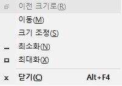

## 왜 동적으로 생성하는가? 

`다중 데이터베이스`에 대한 설정으로 `DataSource`를 설정하고 해당 폴더에서는 설정한 DataSource가 Injection이 될 수 있도록 작업하는 게 일반적이다.

즉, 정적으로 해당 폴더는 혹은 해당 클래스는 어떤 DataSource를 받을 지에 대하여 사전에 정의가 되어 있다는 의미이다. 

동일한 테이블이지만 Sharding이 될 수도 있고 고객마다 다른 Database를 확인해야 하는 경우가 있는데, 이를 처리하기 위해서 동적으로 `DataSource` 를 Injection 할 수 있는 방식이 필요했다.


## AbstractRoutingDataSource 설정


해결방법 1

```
[Alt + Space 키] + [방향 키]
```

-> Alt + Space 키를 누르면 아래와 같은 작은 창이 뜹니다. 
그 중 M에 해당하는 이동(M)을 선택해서 방향키로 화면을 벗어난 프로그램창을 가져오는 방법입니다.

{: .align-center}

```
[Windows키 + p] -> 확장(Extend)선택 -> [Windows키 + Shift키 + 방향키]
```

-> 앞서 전 듀얼 모니터 환경을 사용한다고 말씀드렸는데요. 듀얼 모니터라서 확장을 선택하는 작업까지는 이미 되어있는 상태에서 [Windows키 + Shift키 + 방향키] 이것만 해주면 됩니다. 

12

개인적으로는 2번의 방법을 선호합니다.

이상 화면을 벗어난 프로그램창을 화면 안으로 가져오는 방법에 대해서 알아봤습니다.


references :  
<https://fishpoint.tistory.com/2152>


