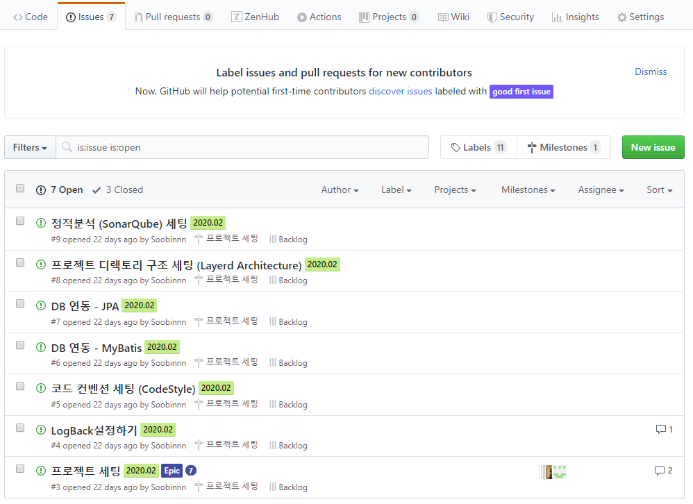

## Github issue 사용법

Github repository를 보면 코드를 보여주는 코드탭을 기본적으로 사용하게 된다. 하지만 이 외에도 여러 기능이 있는데, 지금 소개할 기능은 Issue 기능이다. 

여러 오픈소스 프로젝트들을 보면 github에 소스코드가 올려져 있다. 그 중에서 버그나 개선사항을 받기 위하여 issues 탭에는 상당히 많은 요청들이 생성되어 있다. 

오픈소스에 기여를 하고 싶은 경우, 이슈를 발행하고 해결한 사항에 대해 Pull requests를 보내어 최종 리뷰 후 실제 코드에 적용이 되는데, 이런 식으로 오픈소스에 꼭 기여 해보고 싶다. 

아무튼 아래와 같이 이슈를 만들어서 여러 명이 협업할 때 어떻게 업무를 배정하고 업무를 처리할 지, 해당 내용은 어떻게 공유가 되어야 하는 지에 대해서 github의 기능을 통해서 알아보고자 한다.

{: .align-center}

### Issue 발행하기

`New Issue` 버튼을 누르면 다음의 화면이 나타나게 되고 `issue`를 등록할 수 있다.

`Issue` 를 등록할 때는 `Markdown` 이 지원되므로 적극 활용하여 깔끔한 이슈를 작성하도록 하자.

오른쪽 사이드를 보면 `Issue`를 등록하기 위한 여러 추가 정보들을 기입할 수 있는 란이 있다. 이를 자세히 살펴보면 

- Assignees - 누구에게 업무를 배정할 지, 담당자를 지정할 수 있다.
- Labels - 해당 작업이 버그인 지 개선인 지에 대한 성격을 지정할 수 있다.
- Milestone - 해당 작업이 몇 버전의 업데이트를 위한 것 인지에 대해서 지정할 수 있다. 
- Estimate - 작업 완료까지의 추정 시간을 정할 수 있다.
- Epics  - 해당 작업이 (Epic로 생성된 이슈 중) 어느 이슈의 하위에 속하는 지 정할 수 있다. 

#### Milestone 생성

#### Epic 생성

### Issue template 만들기

### Issue 를 IntelliJ 와 연동하기

### 작업 완료 후 Pull Request

references :  
[GitHub로 프로젝트 관리하기 Part1 - 이슈 발급 부터 코드리뷰까지](https://www.popit.kr/github%EB%A1%9C-%ED%94%84%EB%A1%9C%EC%A0%9D%ED%8A%B8-%EA%B4%80%EB%A6%AC%ED%95%98%EA%B8%B0-part1-%EC%9D%B4%EC%8A%88-%EB%B0%9C%EA%B8%89-%EB%B6%80%ED%84%B0-%EC%BD%94%EB%93%9C%EB%A6%AC%EB%B7%B0%EA%B9%8C/)

