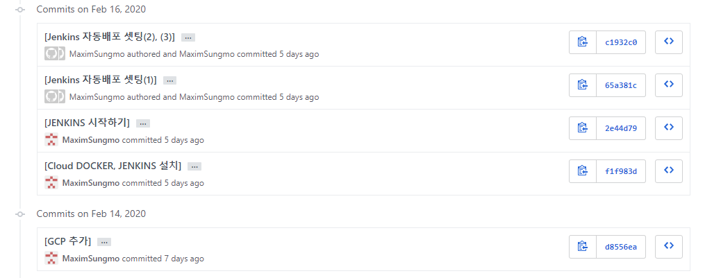

{: .align-center}

## 상황인식

본인은 집 또는 회사 컴퓨터로 작업을 진행하며 git으로 소스관리를 하다보니 작업지가 달라질 것을 고려해서 항상 git에 `push`를 하고 있었다. 

물론 `github`의 본인 계정의 초록색 `커밋로그`가 남는 것도 매우 뿌듯하게 생각하고 있었다.

그런데 자주 commit -> push를 진행하였는데도 불구하고 `커밋로그`가 제대로 남지 않는 것을 확인하게 되었다.

지금과 같은 포스팅을 할 때는 보통 회사 컴퓨터 또는 노트북을 사용하는데, 그 경우에만 `커밋로그` 가 제대로 남지 않는 상황이였고 `repository`의 `commit`을 클릭해서 확인해보니 다른 계정으로 커밋이 진행되고 있는 상황이였다.

---

## 문제점

문제는 바로 내 Git에 연결된 `global config` 설정이 문제였다.

노트북 계정은 임시로 작업하던 git 계정이 연동되어 있었고 회사 계정은 회사의 git 계정으로 연동이 되어 있었다.

이를 확인하는 방법은 다음과 같다.

### git config 확인

git 초기 설정 시 회사계정으로 설정을 하다보니 git의 user 설정이 회사 계정으로 되어 있었다.

다음의 명령어를 통해 현재 프로젝트의 local에 깔려있는 git user는 누구인 지 확인해보자

이를 확인하기 위해서는 clone받은 폴더에서 `.git` 파일이 있는 위치에서 bash창을 열어서 확인한다.

- git config를 프로젝트별로 수정하는 방법 

```
git config user.name
git config user.email
```

---

## 해결방법

### git config 변경하기

`git config`를 바꾸는 방법을 확인해보니 여러가지 방법이 있었다.

다만, 나는 프로젝트마다 다른 `git user`를 설정하고 싶었다. 

이유는 현재 회사의 프로젝트는 회사 계정으로 가져가야하고 간혹 따로 개인 프로젝트를 회사에서 업로드하는 경우가 있는데, 이 경우에는 해당 프로젝트만 내 개인 계정으로 설정되기를 원했기 때문이다.

- 프로젝트 선택적 git user 설정법

1. `.git` 파일에 들어간다.
2. `config` 파일을 연다.
3. `.git/config` 파일 내에서 다음의 항목을 추가한다.

```
[user]
    email = ksm5318@naver.com
    name = MaximSungmo
```

이제 다시 `git config user.name` 으로 확인하면 해당 폴더의 프로젝트는 내가 설정한 유저로 국소 적용된 것을 확인할 수 있다.

이 외에도 global 설정을 변경하는 방법도 있으니 참고하길 바란다.

- git config 를 global로 설정하는 방법 

```
$ git config --global user.name "John Doe"
$ git config --global user.email "John Doe"
```
 
---

## github 저장소 수정

### 기존 remote에 commit 유저 변경하기

이미 회사계정으로 `commit`이 이루어졌기 때문에 이를 변경하는 작업을 하겠다.

우선 `github` 에 들어가서 어떤 계정으로 커밋이 되었는 지 확인한다.

{: .align-center}

총 3개의 계정으로 commit 이 진행된 것을 확인할 수 있다.

이 것을 하나의 계정으로 바꾸기 위해서 다시 `git bash` 로 돌아가 다음의 코드를 작성한다.

```
git filter-branch --env-filter ' 

OLD_EMAIL={예전 이메일}

CORRECT_NAME={변경 사용자명}

CORRECT_EMAIL={변경 이메일}


if [ "$GIT_COMMITTER_EMAIL" = "$OLD_EMAIL" ] 

then 

	export GIT_COMMITTER_NAME="$CORRECT_NAME" 
	
	export GIT_COMMITTER_EMAIL="$CORRECT_EMAIL" 

fi 

if [ "$GIT_AUTHOR_EMAIL" = "$OLD_EMAIL" ] 

then 

	export GIT_AUTHOR_NAME="$CORRECT_NAME" 
	
	export GIT_AUTHOR_EMAIL="$CORRECT_EMAIL" 

fi 

'  --tag-name-filter cat -- --branches --tags
```

위의 명령어가 완성되었으면 commit 을 진행한 사용자가 `local`에서는 바뀌는 것을 확인할 수 있다.

다만, 단순 commit으로는 해당 변경사항을 적용할 수 없으므로 아래의 코드를 통해 강제로 적용할 수 있도록 한다.

```
git push --force --tags origin 'refs/heads/master'
```

출처 : [깃(Git) 커미터(Committer) 이름 변경하는 방법](https://ndb796.tistory.com/265)

{: .align-center}

짜잔 ! 

정확하게 바뀐 모습을 확인할 수 있다. 

{: .align-center}

단, 나의 경우 3개의 계정이 있었고 2개의 계정을 바꿔줘야 했으므로 2번의 반복하여 진행해야 했다. 


근데 다시 작업을 진행하려고 동일한 코드를 치니 에러가 발생했다.

{: .align-center}


이를 해결하기 위해서는 다음의 내용으로 코드를 변경해준다.

변경된 내용은 `git filter-branch -f --env-filter ' `  -f 를 추가하였다는 점이다. 

```
git filter-branch -f --env-filter ' 

OLD_EMAIL={예전 이메일}

CORRECT_NAME={변경 사용자명}

CORRECT_EMAIL={변경 이메일}

...
...
...

'  --tag-name-filter cat -- --branches --tags
```

이제 다시 동일하게 반복해서 최종적으로 commit 사용자를 변경 완료할 수 있도록 한다.


references:

[깃(Git) 커미터(Committer) 이름 변경하는 방법](https://ndb796.tistory.com/265)

https://blog.tinned-software.net/rewrite-author-of-entire-git-repository/

