## Github issue 사용법

Github repository를 보면 코드를 보여주는 코드탭을 기본적으로 사용하게 된다. 하지만 이 외에도 여러 기능이 있는데, 지금 소개할 기능은 Issue 기능이다. 

여러 오픈소스 프로젝트들을 보면 github에 소스코드가 올려져 있다. 그 중에서 버그나 개선사항을 받기 위하여 issues 탭에는 상당히 많은 요청들이 생성되어 있다. 

오픈소스에 기여를 하고 싶은 경우, 이슈를 발행하고 해결한 사항에 대해 Pull requests를 보내어 최종 리뷰 후 실제 코드에 적용이 되는데, 이런 식으로 오픈소스에 꼭 기여 해보고 싶다. 

아무튼 아래와 같이 이슈를 만들어서 여러 명이 협업할 때 어떻게 업무를 배정하고 업무를 처리할 지, 해당 내용은 어떻게 공유가 되어야 하는 지에 대해서 github의 기능을 통해서 알아보고자 한다.

{: .align-center}

### Issue 발행하기

`New Issue` 버튼을 누르면 다음의 화면이 나타나게 되고 `issue`를 등록할 수 있다.

{: .align-center}

`Issue` 를 등록할 때는 `Markdown` 이 지원되므로 적극 활용하여 깔끔한 이슈를 작성하도록 하자.

오른쪽 사이드를 보면 `Issue`를 등록하기 위한 여러 추가 정보들을 기입할 수 있는 란이 있다. 이를 자세히 살펴보면 

- Assignees - 누구에게 업무를 배정할 지, 담당자를 지정할 수 있다.
- Labels - 해당 작업이 버그인 지 개선인 지에 대한 성격을 지정할 수 있다.
- Milestone - 해당 작업 일정 관리 단위에 대해서 지정할 수 있다. 
- Estimate - 작업 완료까지의 추정 시간을 정할 수 있다.
- Epics  - 해당 작업이 (Epic로 생성된 이슈 중) 어느 이슈의 하위에 속하는 지 정할 수 있다. 

- ####  Milestone 생성

`Issue` 를 생성하다보니 사이드탭에 `Milestone`이 있다.

쉽게 생각하면 프로젝트 일정을 관리하는 단위 작업이라고 볼 수 있다.

예를 들어서 1.0.1 버전에서 1.0.2 버전으로 배포 예정인 상황인데, 필수 버그 개선이 1.0.2 버전에 포함되어서 나가야 한다면 해당 작업에 대해서는 1.0.2버전을 `Milestone` 으로 지정하여 작업하면 된다.

생성 방법은 단순하다. 

`Issue`탭에서 `Milestone` 을 누른다. 

{: .align-center}

이 후 생성하기를 누르면 다음과 같이 표시가 되며 어떤 작업 단위를 위한 `Milestone` 인 지 작성한다.

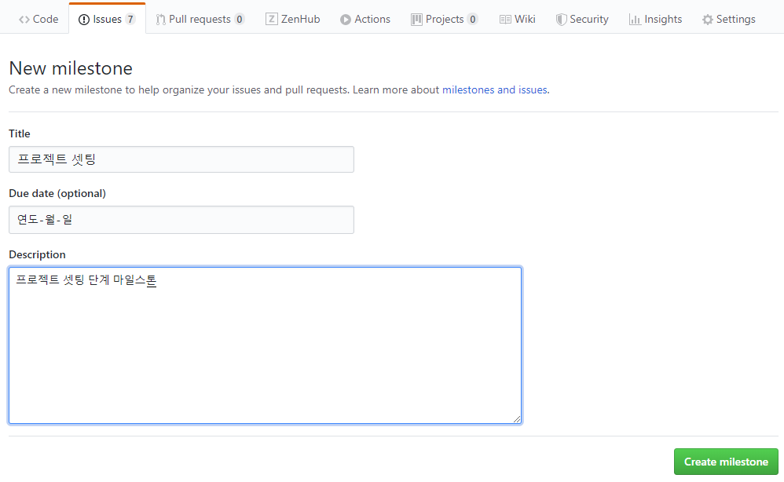{: .align-center}

생성된 `Milestone`은 다음과 같이 확인할 수 있다. 
동일 `Milestone`으로 설정된 경우에는 해당 단위 작업(`Milestone`)에 일정 관리 대상으로 포함된다.

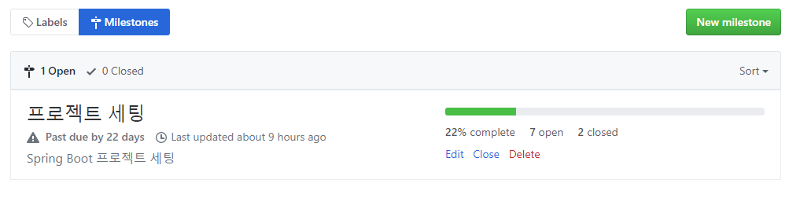{: .align-center}

이 후 이 전에 작성했던 이슈에서 `Milestone` 을 설정한다. 

{: .align-center}

이제 다시 `Issue`탭에서 `Milestone`으로 들어와서 해당 `Milestone`을 클릭해보면 방금 전에 추가한 작업이 `프로젝트 셋팅` 이라는 `Milestone`으로 포함된 것을 알 수 있다.

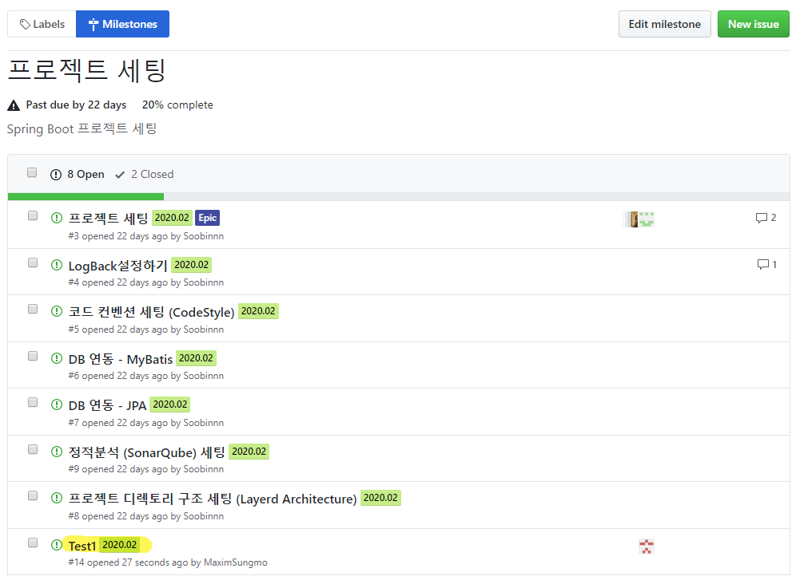{: .align-center}

- #### Epic 생성

위에서 설명한 `Milestone` 과 비슷하지만 조금 다른 개념으로 `Epic`이 있다.

`Epic`은 큰 일정 단위인 `Milestone` 보다는 작은 개념으로 작업을 여러 가지로 나누어서 해야하는 경우에 필요할 수 있다.

예를 들어서 `프로젝트 셋팅`을 하는 단계에서 `Database셋팅` 이라는 `Epic`이 있다면 `Database셋팅`을 위한 여러 작업(스프링의 경우 Mybatis, 다중 Database Source, JPA) 으로 세부 작업들을 나눌 수 있다.

이 모든게 완료가 되어야 `Database셋팅`이라는 `Issue` 가 close 될 수 있으므로 해당 작업은 하나의 큰 작업 단위인 `Epic`으로 묶는 것이다. 

생성 방법은 `Issue`를 생성하는 것과 동일하지만 `Issue`를 생성하는 버튼이 아닌 `Create an epic`을 생성하는 버튼을 누른다. 

물론 `Epic`을 `Labels` 로 지정하는 것도 동일한 `Epic` 생성 방법이다. 하지만 위의 기능으로 생성하면 여러가지 `Issue`를 묶을 수 있는 창을 확인할 수 있다. 

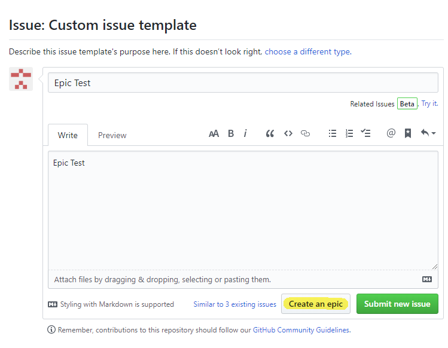{: .align-center}

`Create an epic` 버튼을 누르면 아래와 같은 창이 보여지는데, 이 때 오른쪽 사이드에는 현재 프로젝트의 `Issue`들이 함께 나타나게 된다. 선택 상자를 클릭하면 해당 `Issue`는 현 `epic` 단위로 묶일 수 있다. 

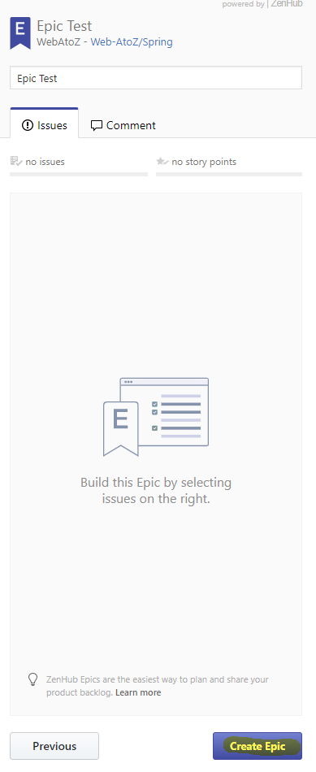{: .align-center}

생성된 `Epic` 을 확인하면 다음과 같다. 이제 `Epic`은 `Issue`는 맞지만 큰 작업 단위의 `Issue`로 보면 된다.
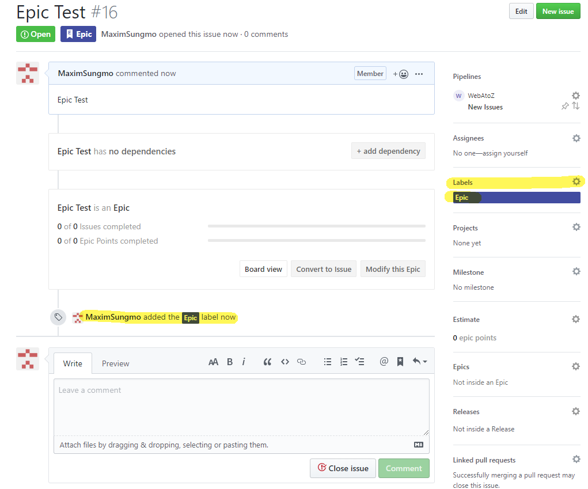{: .align-center}

이 전에 만들었던 `Issue`에 `epic`을 지정해주어 보자.
해당 `Issue`를 들어가서 사이드탭에 `Epics`를 클릭하면 다음과 같이 확인할 수 있을 것이다. 

{: .align-center}

다시 `epic issue` 로 돌아와보면 `Epic`이 설정된 경우에는 해당 `epic issue`에서 하위 작업 목록이 나타나게 된다. 

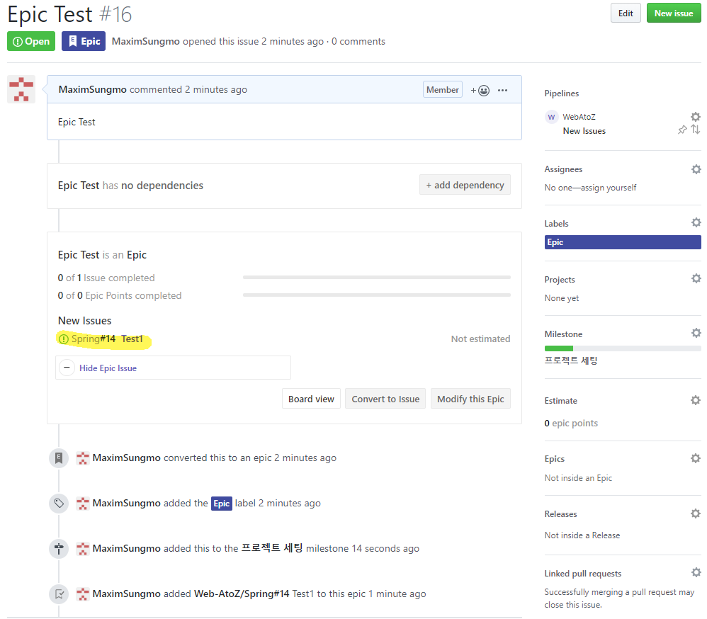{: .align-center}

### Issue template 만들기

`Issue` 를 여러 사람이 올리게 되는 경우에는 일정한 형식에 맞지 않으면 가독성이나 원하는 정보가 누락되는 경우가 아주 많을 것이다. 또한 내가 작업할 때도 필요한 정보를 제대로 기입하지 못하는 일이 발생할 수 있다.

그렇기 때문에 `issue` 의 종류에 따라서 Template을 별도로 만들어놓는 작업이 필요하다.

`Settings` 에 들어가서 `Set up Templtaes` 를 선택한다. 

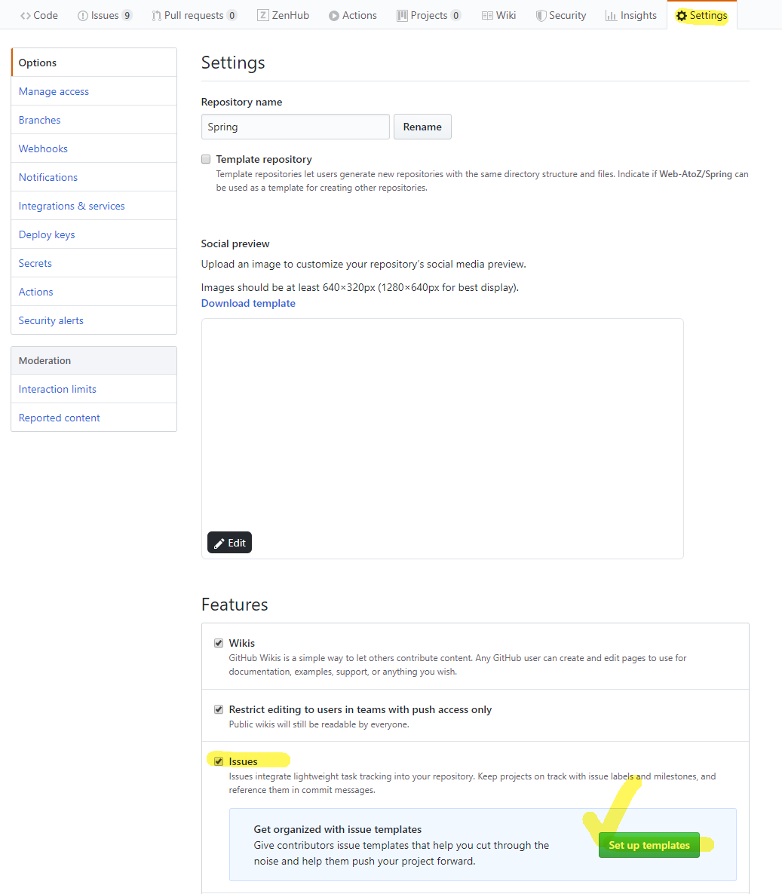{: .align-center}

다음과 같은 화면이 뜰 것인데, 새로 `Template`을 만들거나 기존 `Template`을 수정할 수 있다.

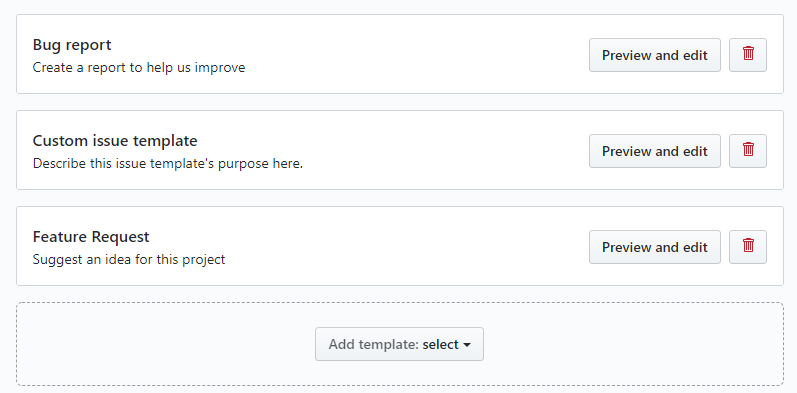{: .align-center}

우선은 기본적으로 `Bug report`를 수정하며 방법을 익혀보자.

기존에 있던 내용을 지우고 `Markdown`을 적용하여 내가 원하는 `Template`을 만든 다음에 저장을 한다.

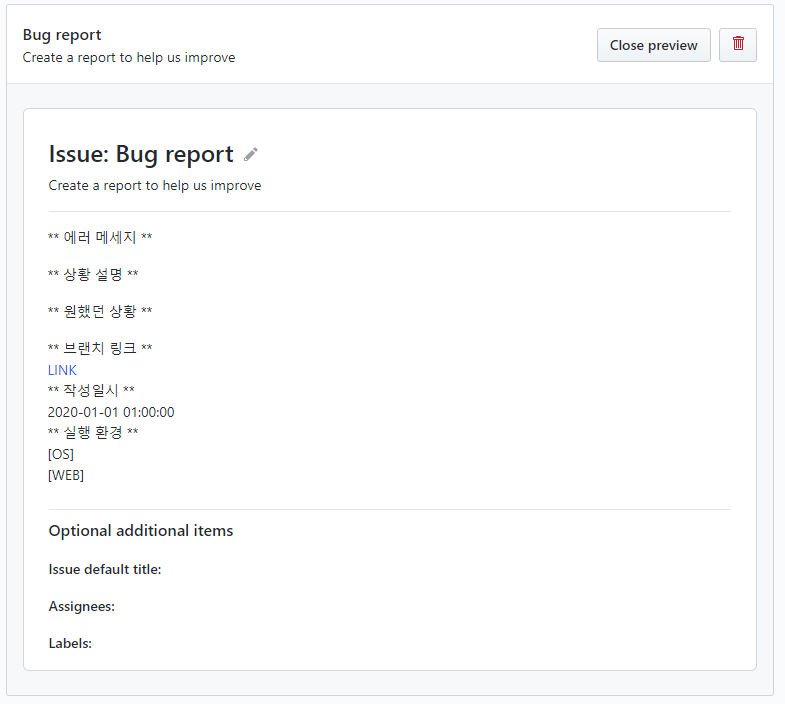{: .align-center}

저장은 우측 상단에 보면 `Propose changes` 라는 버튼이 있다. 

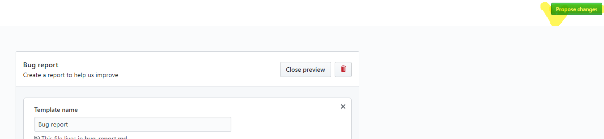{: .align-center}

해당 버튼을 눌러서 최종적으로 저장하면 앞으로는 `NEW ISSUSES`버튼을 클릭하면 다음과 같은 선택창이 나타나게 될 것이다.

따라서 `Issue`를 작성하는 사람은 정해진 양식에 따라 발행할 수 있고 이를 확인하는 사람도 가독성과 원하는 정보를 쉽게 획득할 수 있게 된다. 

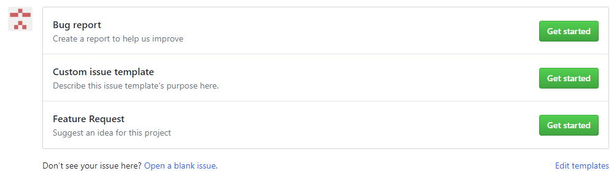{: .align-center}

### Issue 를 IntelliJ 와 연동하기

`Issue`를 `IntelliJ` 와 연동하여 앞으로는 `Issue`단위로 브랜치 작업하고 `Pull Request`를 통한 코드 리뷰 및 소스코드 통합 작업을 진행할 예정이다. 

이를 진행하기에 앞서 우리들의 프로그래밍을 적극적으로 도와주는 IDE의 도움을 받아보자.

나는 IntelliJ 를 사용하므로 이에 대한 설정법을 작성하겠다.

우선은 `ALT + SHIFT + S` 버튼을 눌러 Settings 창을 열고 `Task`를 검색한다.

그 후 내가 `Issue`를 받아올 github 주소를 확인하고 하단의 `Repository`에 정보를 입력한다. 

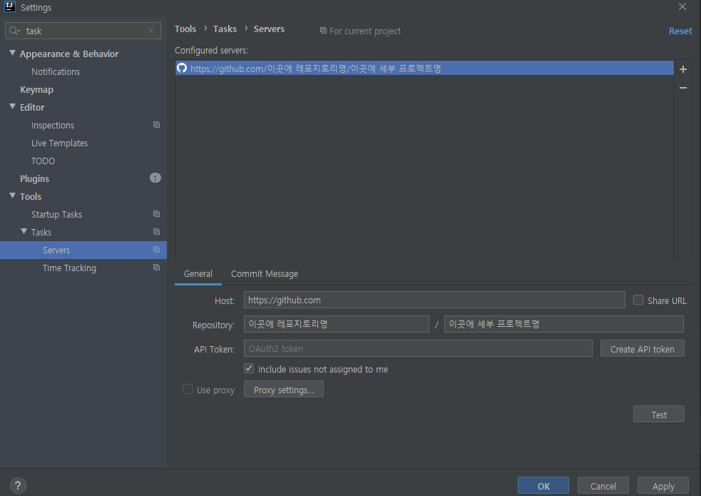{: .align-center}

그 후 나의 IDE가 github에서 정보를 받아올 수 있도록 API Token을 생성하도록 하자.

`Create API Token` 을 누른 뒤 나의 정보를 입력하여 처리한다.

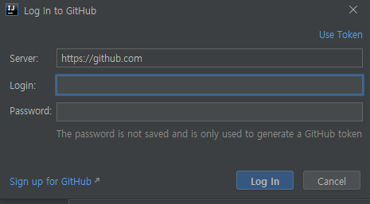{: .align-center}

이제 작업이 완료가 되었다 

`ALT + SHIFT + N` 을 눌러 현재 발행된 `Issue`를 확인하고 나의 `Task`로 가져오도록 한다. 

그럼 해당 이슈에 대한 로컬 브랜치가 새로 생성이 될 것이며 Task 별 작업이 가능해진다.

### 작업 완료 후 Pull Request

모든 코드 수정이 완료가 되었으면 Task 단위로 생긴 로컬 브랜치에서 `Commit` 을 진행한다.

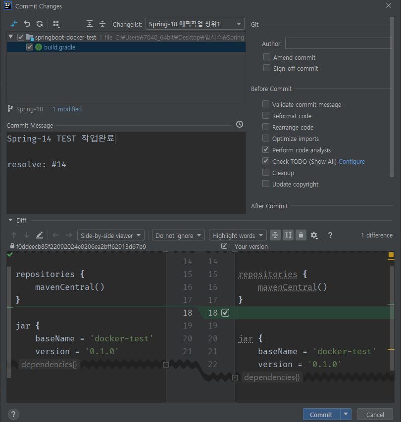{: .align-center}

그 후 `VCS -> GIT -> Create pull request` 를 실행한다. 

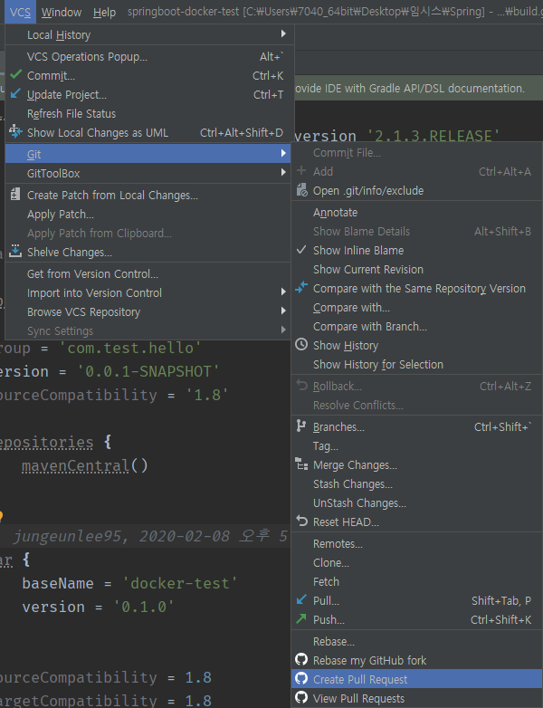{: .align-center}

다음의 화면이 나타나게 되는데, `resolved: #이슈번호` 를 작성하게 되면 해당 이슈가 끝났으므로 자동으로 pull request가 master branch로 merge 완료되면 해당 이슈를 자동으로 클로징 시켜준다. 만약 해당 이슈가 자동으로 클로징되는 것을 원하지 않으신다면 해당 이슈를 따라갈 수 있도록 `issue: #이슈번호` 를 작성해주시면 됩니다. 

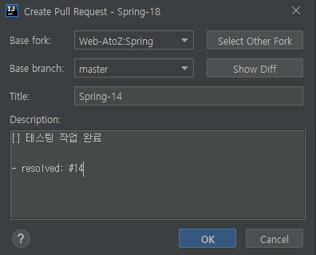{: .align-center}

이제 IDE에서의 작업은 끝이났으므로 다시 Github 페이지로 들어갑니다.

Pull Request가 뭐가 들어왔는 지 확인해보니 위에서 작업했던 게 들어온 것을 알 수 있습니다. 

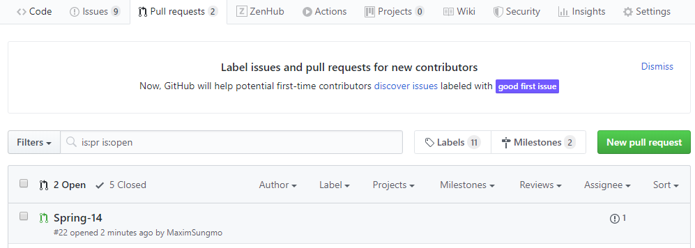{: .align-center}

자세히 살펴보기 위해 클릭해봅시다.

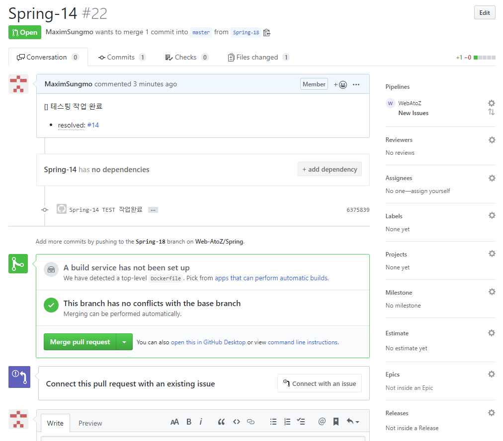{: .align-center}

이제 Pull request를 받았으니 master branch로 합치기 전 코드리뷰 또는 내용 확인을 진행합니다.

### 코드리뷰

우선 내가 만약 팀장 또는 코드를 관리하는 사람이고 다른 곳에서 pull request가 들어온 경우에는 누군가에게 code review를 요청할 수 있습니다.

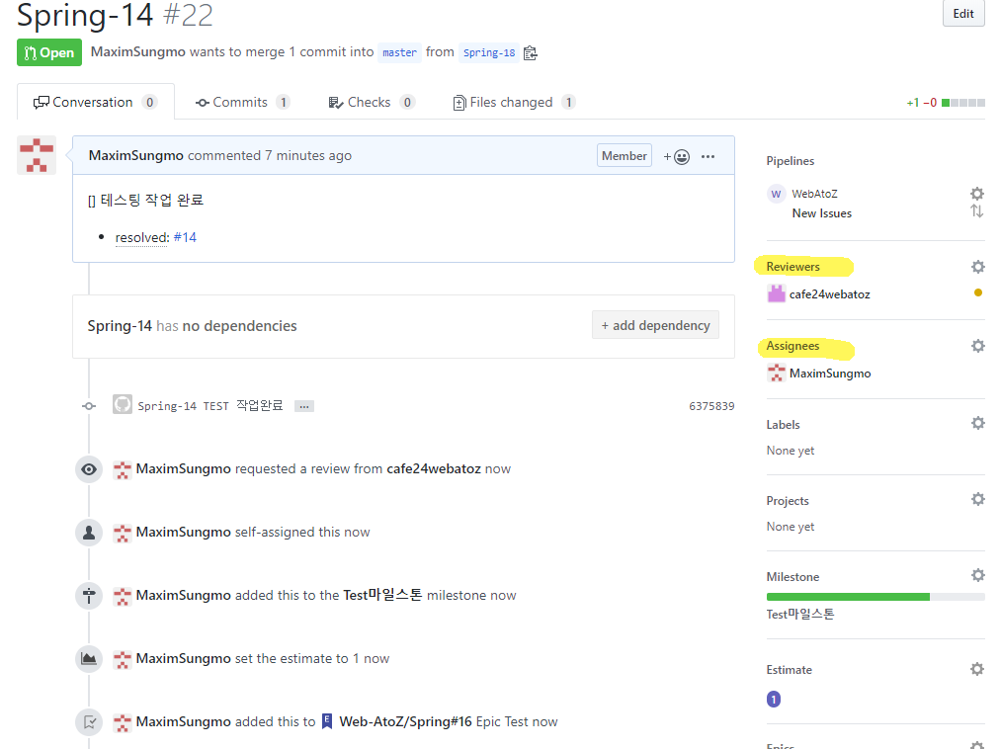{: .align-center}

코드리뷰를 요청하기 위한 대상자를 지정해봅시다. 

이 후 코드 리뷰어가 해당 작업자가 코드를 제대로 작성했는 지 확인하기 위해서 코드를 확인하러 가봅시다.

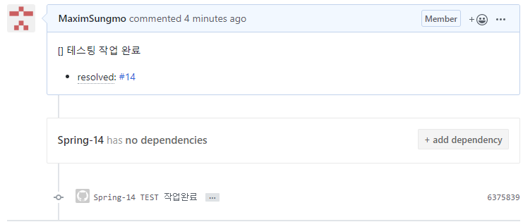{: .align-center}

오른쪽 상단에 보시면 `Review changes` 를 클릭하게 되면 해당 코드에 대한 상세한 코멘트를 남길 수 있게 됩니다.

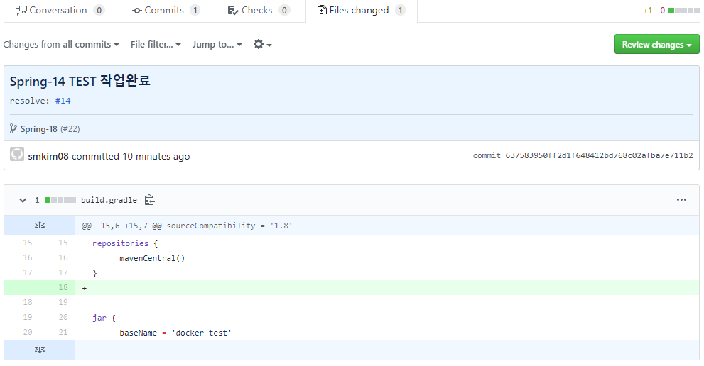{: .align-center}

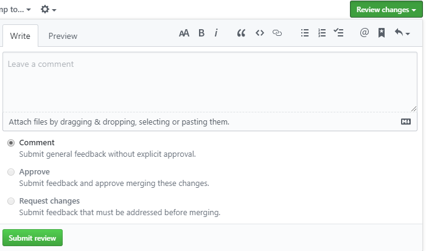{: .align-center}

따라서 해당 코드에 대한 리뷰를 다른 사람들과 함께 진행할 수 있게 되고 모든 코드리뷰가 완료가 되었습니다.

### Merge pull request

 Merge pull request을 통해서 master와 해당 이슈 브랜치가 통합될 수 있게 해줍니다.

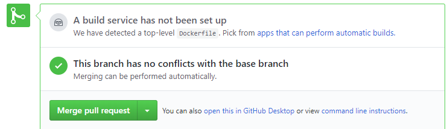{: .align-center}

그리고 Merge도 정상적으로 완료가 되었으면 해당 브랜치가 로컬 브랜치에서 생성되어 원격지로 푸쉬된 상황과 동일하므로 해당 브랜치가 삭제될 수 있도록 해줍니다. 

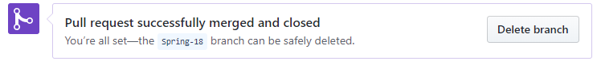{: .align-center}

이상 github을 통한 협업 방식을 익혀보았습니다.

references :  
[GitHub로 프로젝트 관리하기 Part1 - 이슈 발급 부터 코드리뷰까지](https://www.popit.kr/github%EB%A1%9C-%ED%94%84%EB%A1%9C%EC%A0%9D%ED%8A%B8-%EA%B4%80%EB%A6%AC%ED%95%98%EA%B8%B0-part1-%EC%9D%B4%EC%8A%88-%EB%B0%9C%EA%B8%89-%EB%B6%80%ED%84%B0-%EC%BD%94%EB%93%9C%EB%A6%AC%EB%B7%B0%EA%B9%8C/)

