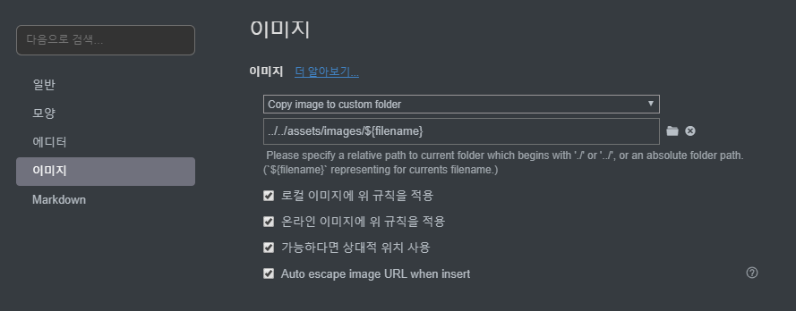
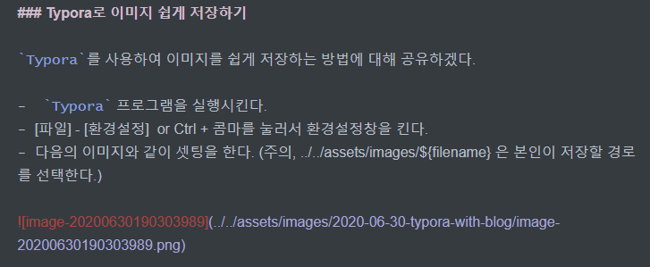
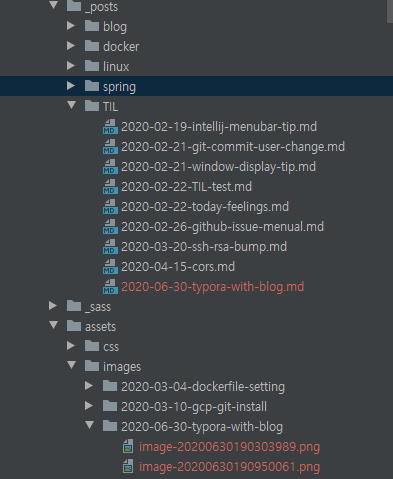
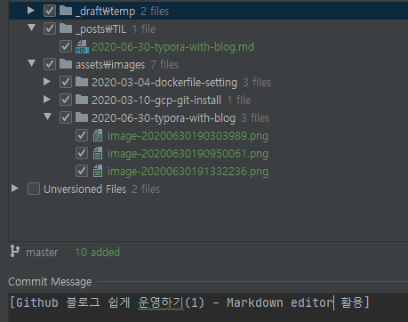

## [Github] 블로그 쉽게 운영하기(1)

### Github 블로그 입문기 

`Github 블로그`를 운영하기 이 전에 `티스토리`에서 블로그를 처음 운영하기 시작했었다. 당시에는 그냥 쉽고 간편하게 글을 올리자는 마음으로 시작하였으며 `typora` 라는 `editor`를 사용했었다. 

하지만 `티스토리`에서 `editor`로 작업 후 다시 올리는 과정이 너무 귀찮았고 손 쉽고 어디서든 연동이 가능한 노트앱이 필요했었다. 

해당 기능을 가진 노트앱을 찾던 중, 예전에 사용해봤던 `에버노트` 가 `티스토리`와 연동이 간단하다는 것을 알게 되었고 이를 사용하여 블로그에 글을 올리기 시작하였다. 

`에버노트`는 정말 쉽고 간편하게 사용할 수 있었으며 나의 요구사항들을 만족시켜주었다. 

다만, 당시에 나는 Github에서 *잔디밭* 채우기에 빠졌었기 때문에 블로그와 github 모두를 처리하는 게 너무 귀찮았었다. 우연한 기회로 같이 스터디를 진행하는 친구에게서 github으로 블로그 운영하는 것을 알게 되었고 이걸 사용한다면 쉽게 *잔디밭* 과 블로그 모두를 잡을 수 있다는 것을 알게 되었다. 

github 블로그는 markdown 으로 작성해야 했으며 이를 위하여 더욱 간단한 에디터를 찾아보기 시작했다. 

### Markdown Editor 선택하기 

처음으로 사용했던 markdown editor 가 `Typora` 였으나 당시에는 사용하는 게 매우 불편했었다. 

이유는 바로 사진 업로드와 관련된 부분이였다. 사진을 내 로컬에 저장하거나 별도로 저장해야 하는 점이 매우 거슬렸다..

그래서 다른 에디터를 찾아보고자 검색을 시작했다. 

검색 결과 다음의 블로그에서 여러 에디터를 비교해주는 것을 참고하였다.

[최고의 마크다운 에디터는? (macOS/Windows)](https://futurecreator.github.io/2018/07/20/what-are-the-best-markdown-editor/) 

결론부터 말하자면 나는 `Typora`를 쓰기로 하였다. 

이유는 명확하다. 불편했던 이유가 해소되었기 때문이다. 

### Typora로 이미지 쉽게 저장하기

`Typora`를 사용하여 이미지를 쉽게 저장하는 방법에 대해 공유하겠다. 

-  `Typora` 프로그램을 실행시킨다. 
- [파일] - [환경설정]  or Ctrl + 콤마를 눌러서 환경설정창을 킨다.
- 다음의 이미지와 같이 셋팅을 한다. (주의, ../../assets/images/${filename} 은 본인이 저장할 경로를 선택한다.)

위와 같이 작업하면 앞으로 나는 캡처된 사진을 붙여넣을 시 해당 위치에 파일이 저장되게 된다. 

> 모든 포스트는 동일한 공간에서 생성해야만 한다. 가령 _posts라는 디렉토리에서 작업하는 경우에는 해당 경로에서 typora로 작성한다. 그래야만 상대적인 위치에 이미지가 정상적으로 저장이 될 것이기 때문이다. 

### Github 블로그에서의 포스트와 이미지의 간편한 업로드

Github 블로그에서는 commit -> push를 통해 page를 빌드시킨다. 

그렇기 때문에 현재 내 로컬의 있는 포스팅, 이미지 모두 업로드가 되어야하고 이미지에 대한 경로는 빌드 시 인식할 수 있는 곳에 있어야만 한다. 

따라서 위의 `Typora로 이미지 쉽게 저장하기` 파트에서 설정한 부분이 필요했다. 

내 블로그가 build되는 시점에서 루트 다음의 링크를 확인하길 바란다. [루트 위치 참고](https://github.com/MaximSungmo/maximsungmo.github.io) 

따라서 이미지를 읽는 위치또한 동일하게 나타나야만 실제 build시 이미지를 불러올 수 있게 된다. 

이 글을 작성하면서 사진을 하나 첨부했었는데, 그 사진에 대한 위치는 다음과 같이 기록이 된다.

이렇게 잘 입력이 되었다면 현재의 포스트를 업로드해서 제대로 웹상에서 확인이 되는 지 보자.

### 포스팅 push, 업로드 확인

나의 경우에는 `intelliJ` 를 사용하여 push를 진행하고 있으며 해당 디렉토리에서 따로 처리할 부분은 다음과 같다. 

Push 가 정상적으로 이뤄져야만 해당 image가 build된 위치에서 읽어낼 수 있기 때문에 빨간색으로 표시된 `미추적`파일 들을 add 시켜서 함께 업로드하면 된다. 

다음과 같이 작업한 뒤 빌드가 정상적으로 되는 지 확인하고 안되는 경우엔 경로를 수정하면 될 것이다.

