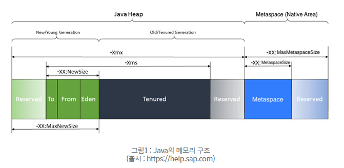

# 질문

## 질문 내용

- GC 에 대해서 설명하세요.

## 질문 목적

- JVM 구조에 대해 이해를 하고 있는가?
- Garbage Collector 의 동작 방식을 이해하고 있는가?
- GC 별 차이점을 알고 있는가?

## 핵심 포인트

- STOP-THE-WORLD
- HEAP
- Young Generation / Old Generation
- Minor GC, Major GC

# GC 종류

- **SerialGC (싱글 스레드)**
- **ParallelGC(멀티 쓰레드, JAVA8 Default)**
- **ConcurrentMarkSweepGC**
  1. STOP-THE-WORLD 를 줄임
  2. Init mark 클래스로더에서 가장 까가운 객체 중 살아있는 객체 찾기만함(STW) 
  3. 위에서 살아있는 객체의 참조 객체따라가 확인(STW가 진행되지 않고 스레드 같이 실행)
  4. Remark 단계에서 새로 추가된, 참조가 끊긴 객체 확인(STW)
  5. Low Latency GC라고 반응소도가 중요한 어플리케이션에서 사용
  6. STW 가 짧은 장점 / 메모리, CPU 사용율 높음, Compaction 단계가 기본적으로 없음
  7. 사용 상 주의! Compaction 단계가 기본 제공되지 않아 조각난 메모리 compaction 시 STW 가 엄청길 수 있음. 
- **GarbageFirstGC(G1GC)**
  1. 바둑판으로 각 영역에 객체를 할당, 해당 영역이 꽉차면 GC
  2. 기존의 Young → Old 영역은 고정되어 있었다면 이번엔 Region으로 역할이 동적으로 부여되므로 바둑판 영역에서 각 영역들이 동적으로 바뀜 
  3. 멀티스레드 GC
  4. Full GC 수행될 시  Init Mark(STW)→ Root Region Scan → Concurrent Mark → Remark(STW) → Cleanup(STW) → Copy 단계를 거침


## Error Message에 따른 대응

- OOM - GC Overhead limit exceed 
  CPU 사용량 중 98% 이상이 GC 를 진행하였으나 Heap 영역의 크기가 2% 이하로 남았을 때 발생

  ```
  // JAVA 어플 실행 시 옵션 추가
  Java -Xmx1024m javaApplication
  ```

- GC 로 인한 STW 발생, 이에 따른 외부통신 Timeout 발생 시 
  GC의 STW 가 너무 길어서 발생한 문제, G1 GC로 STW 시간을 줄임, -Xmx를 늘려도 괜찮음.

# Java 버전별 기본 GC

- Java8 : ParallelGC
- Java9: G1 GC

# Java 메모리 구조


# 참고 자료

[https://d2.naver.com/helloworld/1329](https://d2.naver.com/helloworld/1329)

[https://mirinae312.github.io/develop/2018/06/04/jvm_gc.html](https://mirinae312.github.io/develop/2018/06/04/jvm_gc.html)

[http://homoefficio.github.io/2020/04/09/Java-Memory-Monitoring/](http://homoefficio.github.io/2020/04/09/Java-Memory-Monitoring/)