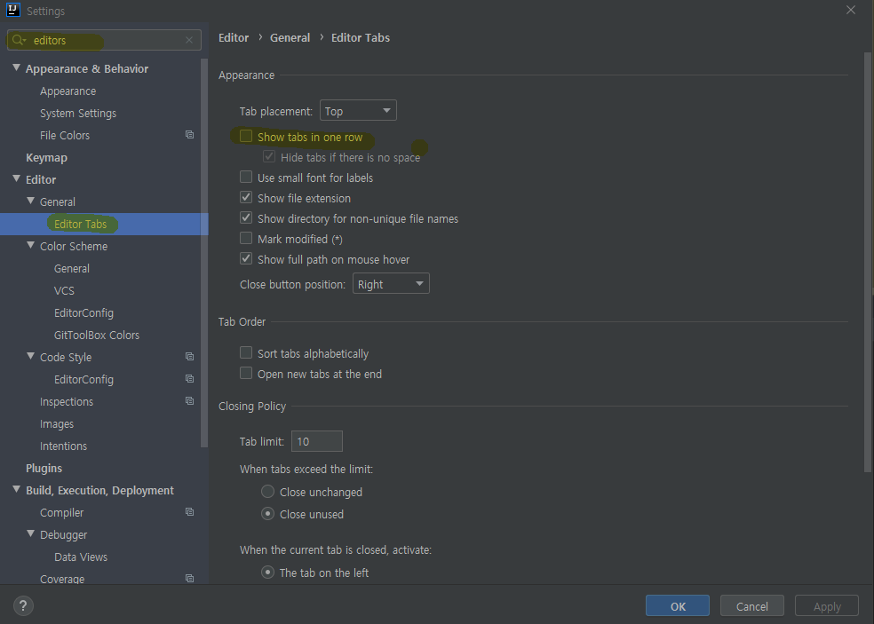

## 인텔리제이(IntelliJ) 메뉴바 여러개로 분할

여러 개의 파일을 열어서 작업을 하다보면 IDE의 메뉴바가 많아지게 된다. 

어느 파일로 이동을 할 때 계속해서 파일 디렉토리를 보면서 찾을 수 없는 노릇이고 간단하게 작업하기 위해 여러 개의 파일을 열어서 작업하니 메뉴바에 파일명이 보이지 않게 된다. 

아래와 같이 토스트로 다른 창으로 이동할 수 있게 도움을 주고 있긴 하지만 내가 원하는 건 한 번에 내가 원하는 파일로 이동하여 작업하는 것이다. 

이를 IntelliJ 에서 설정을 통해 해결하도록 하자.

`Crtl + Alt + S` 를 누르면 다음과 같은 `Settings` 창이 나타나게 된다.

`editor` 를 검색하고  `Editor Tabs` 로 이동하면 `Show tabs in one row` 에 체크 표시가 되어 있는 것을 확인할 수 있다. 

이를 `체크 해체` 해주면 된다. 

짜잔 ! 

아래의 사진과 같은 방식으로 변경이 되었다. 

이제 여러 파일을 돌아다니며 작업하기가 훨씬 수월해졌다. 

