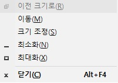

제 업무 환경은 더블 모니터로 구성되어 있는데요.

간혹 프로그램창이 모니터 화면을 벗어나 선택할 수 없는 상태가 되는 경우가 있어요.

화면은 안보이는데 저장은 되어있는 지 모르겠고 또 껏다 킬 수도 없는 경우에 매우 답답하죠. 

이런 문제를 해결할 수 있는 방법을 소개해드립니다.

## 해결방법

### 해결방법 1

```
[Alt + Space 키] + [방향 키]
```

-> Alt + Space 키를 누르면 아래와 같은 작은 창이 뜹니다. 
그 중 M에 해당하는 이동(M)을 선택해서 방향키로 화면을 벗어난 프로그램창을 가져오는 방법입니다.



### 해결방법2 
```
[Windows키 + p] -> 확장(Extend)선택 -> [Windows키 + Shift키 + 방향키]
```

-> 앞서 전 듀얼 모니터 환경을 사용한다고 말씀드렸는데요. 듀얼 모니터라서 확장을 선택하는 작업까지는 이미 되어있는 상태에서 [Windows키 + Shift키 + 방향키] 이것만 해주면 됩니다. 


개인적으로는 2번의 방법을 선호합니다.

이상 화면을 벗어난 프로그램창을 화면 안으로 가져오는 방법에 대해서 알아봤습니다.


references :  
<https://fishpoint.tistory.com/2152>


