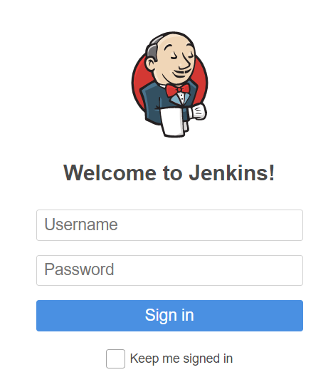
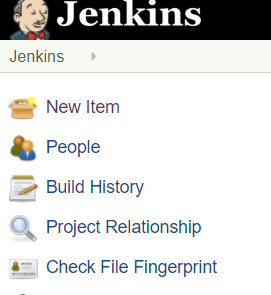
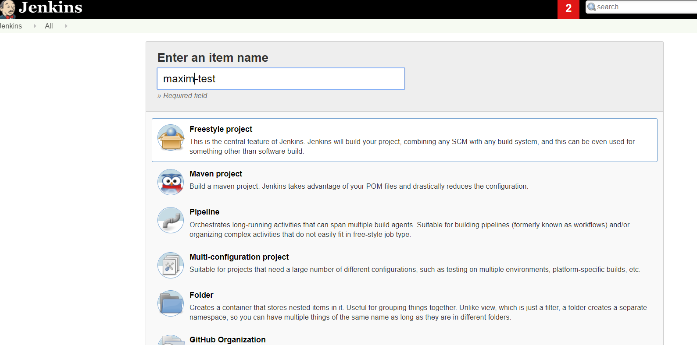

# [Jenkins] Google Cloud Platform에 연결하기

## 1. 방화벽 확인 및 해제 

- 방화벽 규칙 설정 클릭 

- 방화벽 규칙 만들기 클릭 

- 포트 tcp:에 지정해서 만들기 (Jenkins 는 별도의 포트만으로 분리해서 관리 예정)

## 2. Jenkins 접속 

http://{ip주소}:{포트번호} 로 접속하면 다음의 화면이 나타난다.

### Project job 생성

- New Item 클릭

- Freestyle project 생성 

### github 계정 jenkins와 연동 

다음으로 Persnal access token 을 받아보기 위하여 Generate new token을 클릭한다.

아래와 같이 repo와 admin:repo_hook 을 체크한 뒤 생성한다.

이 작업을 통해 secret key를 발급받게 되었다.

이제 Jenkins에서 github 계정과 연결을 해보자.

Configure System 을 클릭한 뒤 [Github] 에 대한 내용을 add 시킨다.

~~위에서 받았던 secret key를 입력할 수 있도록 하단의 화면처럼 셋팅한다.~~

~~Secret 에는 github에서 받았던 secret Key를, ID 에는 github username을 작성한 뒤 add 하고 test connection 이 정상적으로 되는 지 확인한다.~~

이상하게도 위의 작업으로 credentials 이 제대로 생성되지 않았다. 

다음의 작업으로 대체한다.

이제 위의 작업으로 인해 Credentials 이 생성되었다. 

아직 셋팅이 조금 더 남았으니 아래로 가보자

- Build Trggers 에서 셋팅을 다음과 같이 추가해준다. 

- Build 발생시의 트리거에 대한 script를 다음과 같이 간단하게 작업한다. 

### github 브랜치 설정, trigger 연동

우선은 테스트를 위한 작업이므로 git에 브랜치 하나를 생성하고 오도록 하자.

참고자료 : 
<https://kutar37.tistory.com/entry/Jenkins-Github-%EC%97%B0%EB%8F%99-%EC%9E%90%EB%8F%99%EB%B0%B0%ED%8F%AC-3>
