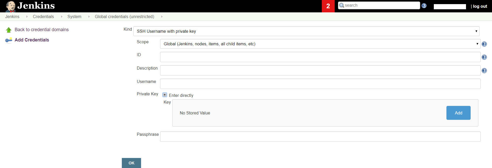
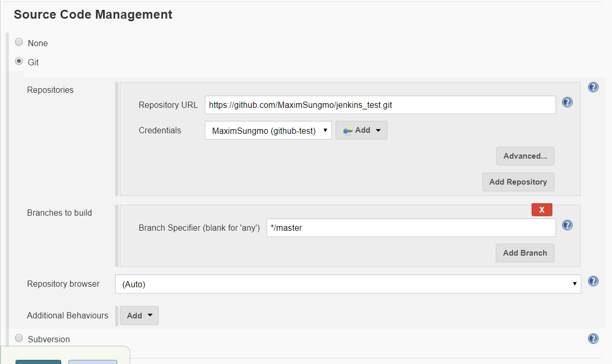
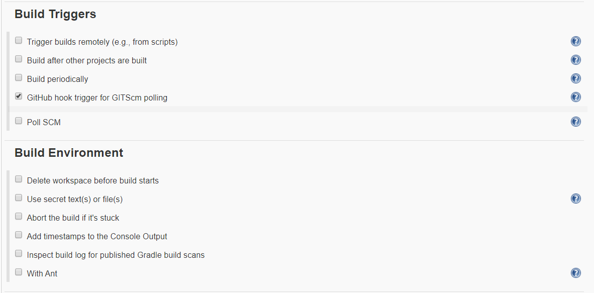

## 1. Jenkins 에 Job만들기

http://{ip주소}:{포트번호} 로 접속하면 다음의 화면이 나타난다.


### Project job 생성

- New Item 클릭


- Freestyle project 생성


#### github 프로젝트 jenkins와 연동 

Github 프로젝트와 Jenkins를 연동하기 위하여 다음의 위치에 .ssh 디렉토리를 만든다.


```
mkdir ./ssh
```


이제 ssh key를 만들어보자.

```
ssh-keygen -t rsa -f /home/sunrise5318/.ssh/github-test
```

제대로 생성되었는 지 확인하기 위하여 해당 폴더로 이동한 뒤 다음의 명령어를 입력한다.

```
ls -al
```


이제 github 프로젝트로 이동해서 `setting`으로 들어간다. 

`deploy keys` -> `add deploy key` 를 클릭한다. 


key 는 생성된 ssh key 중 뒤에 .pub 이 붙은 것을 확인하면 된다.

```
cat github-test.pub
```


완료가 되면 다음과 같은 화면을 볼 수 있다.


이제 다시 Jenkins manage page로 접속해서 해당 프로젝트의 credentials 을 등록한다.




이제 모두 등록이 되었으므로 Project 생성을 이어나가보자.







reference : 
<https://kutar37.tistory.com/entry/Jenkins-Github-%EC%97%B0%EB%8F%99-%EC%9E%90%EB%8F%99%EB%B0%B0%ED%8F%AC-3>


https://jojoldu.tistory.com/442