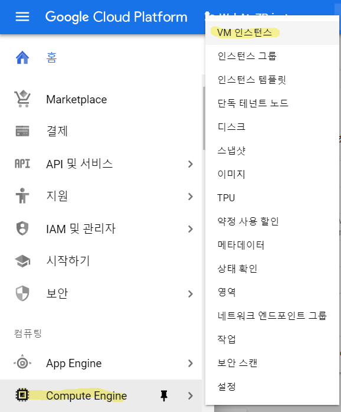
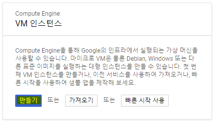
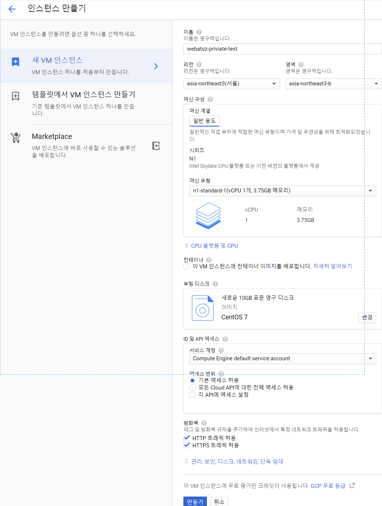

{: .align-center}

## 1. VM인스턴스 생성하기 

`[Compute Engine]-[VM인스턴스]` 을 선택한다.

{: .align-center}

몇 분 기다리면 `만들기` 버튼이 활성화 되므로 잠시 기다린 후 `만들기` 눌러 준비한다. 

{: .align-center}

- 테스팅을 위한 서버이므로 1개의 CPU만을 할당하여 1년 간 여러 테스트를 진행 

- Centos를 주로 사용하는 업무 환경이므로 부팅이미지는 Centos7 으로 설정하였다. 

- 80포트와 443포트로 접근 허용을 위하여 HTTP, HTTPS 트래픽을 허용하였다. 

{: .align-center}

만들기를 클릭하면 다음과 같이 화면을 이동하여 기본 VM인스턴스 만들기가 완료되었다. 

{: .align-center}

접속을 위하여 `연결`에 있는 `SSH 클릭` - `브라우저 창에서 열기` 를 통하여 나의 VM인스턴스에 접속할 수 있게 된다.

여기까지의 작업은 매우 간단하므로 누구나 무리없이 따라왔을 것으로 생각한다.

다음으로 알아볼 내용은 나의 VM 인스턴스에 접속하여 `도커 설치하기` 를 진행하겠다. 