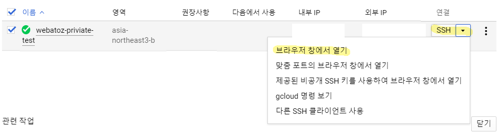
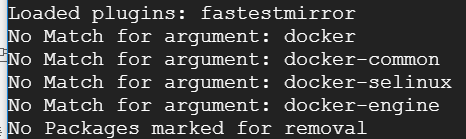
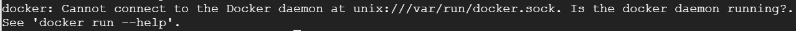
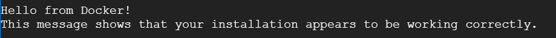
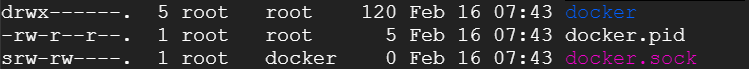

이 전 포스팅에서 VM 인스턴스를 생성하였다. 


이제 VM 인스턴스에 접속하여 브라우저창으로 리눅스환경을 경험해 볼 것이고 요즘 대세인 컨테이너 환경 구성을 위한 `도커`를 설치하겠다. 


## 1. VM인스턴스에 접속하기 



위와 같이 `브라우저 창에서 열기` 버튼을 눌러 VM 인스턴스를 실행시켜보자.


연결 중 메세지와 함께 SSH 키를 VM에 전송하게 된다. 


이제 VM Ware에 Centos7을 올려서 사용하듯 동일한 상황이 된다.

`도커`를 설치하여 보겠다. 


## 2. 도커 설치하기 


도커를 설치하기 전 우선 나의 VM인스턴스의 yum update를 진행한다.

- yum update

```
sudo yum -y update 
```


현재의 상황에서는 도커를 따로 설치한 적이 없기 때문에 이전 버전에 대한 제거를 실행할 필요는 없지만 혹시 모르니 확인하도록 한다.

- 도커 설치 확인 및 이전 버전 제거 

```
sudo yum remove docker docker-common docker-selinux docker-engine
```

본인의 경우에는 다음의 메세지가 출력되었다. (이 전에 설치된 적이 없는 상황)




- 도커 설치를 위한 필수 패키지를 설치

```
sudo yum install -y yum-utils device-mapper-persistent-data lvm2
```

도커의 경우 stable 과 Edge 두 가지의 업데이트 채널이 존재하는데, 우리는 안정적인 업데이트 버전을 사용하기 위한 작업을 진행할 것이다.

- Stable 저장소 설정 

```
sudo yum-config-manager --add-repo https://download.docker.com/linux/centos/docker-ce.repo
```

- `Docker` 설치

```
sudo yum install docker-ce
```


자, 여기까지 작업을 통해서 `docker` 가 설치되었다. 

이제 정상적으로 설치가 되었는 지 확인해보자.

- 설치가 되었는 지 테스트하기 

```
sudo docker run --rm hello-world
```


어? `docker` 가 제대로 실행되지 않네 ?



에러가 발생한 것을 확인할 수 있다.

`docker` 프로그램을 설치는 하였지만 실행은 하지 않았으므로 다음의 명령어로 실행한다.

```
sudo systemctl start docker
```


그리고 다시 설치되었는 지, 실행이 되었는 지 확인해보자.

```
sudo docker run --rm hello-world
```




정상적으로 실행되는 것을 확인하였다.


이제 앞으로 VM인스턴스가 실행될 때 docker 서비스가 등록 및 시작될 수 있도록 하겠다.

```
sudo systemctl enable docker
```


위에서 확인한 `docker.sock` 파일이 뭐길래 `docker`실행 시 돌아가는 지 확인을 하는 것일까?

관련된 내용은 추가 학습이 필요하겠지만 우선적으로 `docker.sock` 파일이 어떤 권한을 가지고 있는 지 확인을 해보자. 


### 도커 연결 권한 확인 

위의 `에러메세지`에서 확인할 수 있듯, 다음의 위치로 이동해서 내용을 보자

```
cd /var/run 
ls -al
```




`docker.sock` 파일은 docker 그룹으로 구분되어 있는 것을 확인할 수 있고 공용에서의 권한은 0으로 아무것도 할 수 없다는 것을 알 수 있다. 이는 추후 컨테이너 구성에 중요한 포인트가 되므로 우선 알고 있도록 하자.


이제 다음 포스팅에서 `docker` 를 통해 `jenkins container`를 실행하는 방법을 알아보겠다.


reference : 

https://suwoni-codelab.com/docker/2018/06/06/Docker-Install/