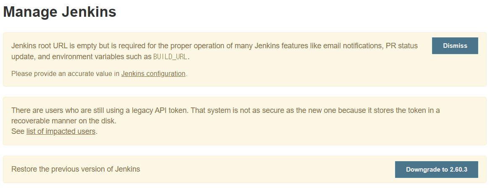

이 전 포스팅에서는 `docker`를 설치하는 방법에 대해 알아보았다.


이제 `docker`를 통해서 `Jenkins Container`를 설치하는 방법에 대해서 알아보겠다. 

## dockerhub에서 Jenkins pull 받기

`dockerhub`에 등록된 Jenkins images를 사용해서 Jenkins Container를 실행해보겠다.

우선 Jenkins image를 pull 받도록 하자.

```
docker pull jenkins 
```

### 문제 발생, 권한 문제

어라? 에러가 발생하였다. 에러 내용을 잘 읽어보니 권한이 없다고 한다. 


docker.sock에 대한 권한이 없다...? 이 전 포스팅에서 관련된 docker.sock을 확인해보지 않았나? 사용하기 위해서는 어떤 권한이 필요했던가? 바로 docker group에 현재 User가 등록이 되어야 한다. 

관련된 포스팅은 다음의 포스팅에서 참고하였으니 꼭 참고할 수 있도록 한다.

[**Docker #2. 도커 그룹에 유저 추가 하기!**](https://gmyankee.tistory.com/179)

결론적으로 해결책은 다음과 같다. docker group에 나의 계정을 추가해서 권한을 획득하는 것.

```
sudo usermod -aG docker $USER
```

이제 권한 획득 후 재시작을 해보자.

아예 `exit` 후 다시 접근한 다음 docker 명령어가 제대로 실행되는 지, 권한은 있는 지 다음과 같이 확인한다.

```
docker ps 
```


이제 다시 Jenkins image를 받도록 하겠다.

```
docker pull jenkins 
```

pull 이 완료가 되면 image가 제대로 다운로드 되었는 지 확인한다.

```
docker images
```


정상적으로 pull 이 받아져서 나의 docker image로 존재하는 것을 확인할 수 있었다.


## Jenkins Container 실행하기

Jenkins container를 만들어서 실행시켜보자.

다음의 포스팅을 통해 쉽게 작업할 수 있었다.

[Docker Container로 Jenkins 설치](https://www.leafcats.com/215)


```
docker run -d -p 9090:8080 -v /jenkins:/var/jenkins_home --name jenkins -u root jenkins
```

본인의 경우에는 jenkins 포트를 9090으로 작업하도록 하겠다. 

다음과 같이 컨테이너를 실행시킨 뒤 {ip}:9090 접속을 시도한 결과 접속이 불가능하였다.

문제는 방화벽이 열려있지 않았기 때문이다. 


### 방화벽 규칙 만들기 

아래의 사진을 보며 동일하게 작업하도록 하자.


- 로그는 `사용 안함`을 선택합니다. 


- TCP로 9090 포트를 열어준다.(Jenkins 용)


다음과 같이 jenkins를 위한 포트가 열려있는 것을 확인할 수 있다.


이제 jenkins로 접속해보자.

다음과 같은 화면을 볼 수 있을 것이다.


비밀번호를 알 수 있는 방법은 여러가지가 있지만 다음의 방식으로 확인을 하겠다.

```
docker logs jenkins
```

비밀번호스럽게 생긴 코드를 확인할 수 있을 것이다.

복사하여 붙여넣어주면 된다.


관련 내용을 보면 실제로 첫 비밀번호 확인 위치는 jenkins container 안으로 들어가서 다음의 위치를 참고하면 되겠다.

```
docker exec -it jenkins bash
// jenkins container 안으로 접속
```


이제 시작 후 기본 플러그인이 자동설치가 되도록 체크하였으나 본인의 경우 OWASP ... 플러그인 하나만 정상 설치되었고 나머지는 설치가 진행되지 않았다. 

단, 플러그인의 경우 어차피 나중에 필요한 플러그인을 설치하면 되므로 continue 버튼을 눌러 진행하도록 하자.


아이디와 패스워드를 입력하여 Admin 계정을 생성한 뒤에 최종적으로 아래와 같은 화면이 나오면 Jenkins Container 가 무사히 설치되었다는 것을 확인할 수 있다.


잠깐! 

Manage Jenkins를 들어가보니 에러 메세지들을 확인할 수 있었다.


왜 위에서 플러그인이 제대로 설치되지 않았는 지 이유가 있었다.

아래로 스크롤을 내리다보면 upgrade 시키는 버튼이 있는데, 해당 버튼을 누르고 restart를 진행하면 다음과 같이 많은 플러그인이 설치된다.




앞으로 Github의 프로젝트를 Jenkins와 연동시켜 자동으로 배포될 수 있도록 Job을 만드는 방법에 대해서 공유하도록 하겠다.


reference : 

[Docker #2. 도커 그룹에 유저 추가 하기!](https://gmyankee.tistory.com/179)
[Docker Container로 Jenkins 설치](https://www.leafcats.com/215)