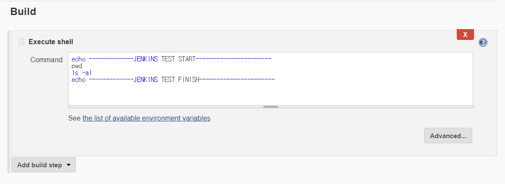

## 1. Jenkins 에 Job만들기

http://{ip주소}:{포트번호} 로 접속하면 다음의 화면이 나타난다.


### Project job 생성

- New Item 클릭


- Freestyle project 생성


### github 프로젝트 jenkins와 연동 

Github 프로젝트와 Jenkins를 연동하기 위하여 다음의 위치에 .ssh 디렉토리를 만든다.


```
mkdir ./ssh
```


이제 ssh key를 만들어보자.

```
ssh-keygen -t rsa -f /home/sunrise5318/.ssh/github-test
```

제대로 생성되었는 지 확인하기 위하여 해당 폴더로 이동한 뒤 다음의 명령어를 입력한다.

```
ls -al
```


이제 github 프로젝트로 이동해서 `setting`으로 들어간다. 

`deploy keys` -> `add deploy key` 를 클릭한다. 


key 는 생성된 ssh key 중 뒤에 .pub 이 붙은 것을 확인하면 된다.

```
cat github-test.pub
```


완료가 되면 다음과 같은 화면을 볼 수 있다.


이제 다시 Jenkins manage page로 접속해서 해당 프로젝트의 credentials 을 등록한다.


이제 모두 등록이 되었으므로 Project 생성을 이어나가보자.





### Webhook 설정

Github에 무엇인 가 push가 되었을 때 jenkins에 알려줄 수 있도록 webhook을 설정하도록 한다.

`Manage Jenkins` - `Configure System` 을 클릭한다. 


`Ctrl + F ` 를 눌러서 Jenkins Location 을 찾는다.


해당 Jenkins URL 이 현재 나의 서버 주소와 같은 지 확인한다.


다시 Github 프로젝트로 돌아가서 Webhook을 셋팅한다.


Jenkins URL/github-webhook/ 을 `payload URL` 에 입력해주고 Content type 을 json으로 변경한 뒤 Add webhook을 누른다.


잘 설정이 되었다면 아래와 같은 화면을 확인할 수 있을 것이다. 


### Webhook 테스트 

이제 github로 돌아가서 파일을 push해보자. 정상적으로 git에서 pull 받은 뒤 명령어가 진행되었는 지 확인해보면 다음과 같이 확인할 수 있을 것이다 .


또한 실제 git 의 webhook을 인지한 jenkins가 어떤 콘솔 명령을 내렸는 지 확인할 수 있다.


### 마무리 

이제 다른 프로젝트가 github에 연동되는 경우에도 `ssh key` 로 인증하고 `webhook` 을 설정하여 git push 작업을 인지한 뒤 git pull, 이 후 명령어들을 진행할 수 있도록 셋팅이 완료 되었다. 

<u>**자동 배포를 위한 초석이 마련되었으니 기뻐하자.**</u>


reference : 

[[Jenkins] Github 프로젝트 연동, webhook, 자동배포 (3)](https://kutar37.tistory.com/entry/Jenkins-Github-%EC%97%B0%EB%8F%99-%EC%9E%90%EB%8F%99%EB%B0%B0%ED%8F%AC-3)