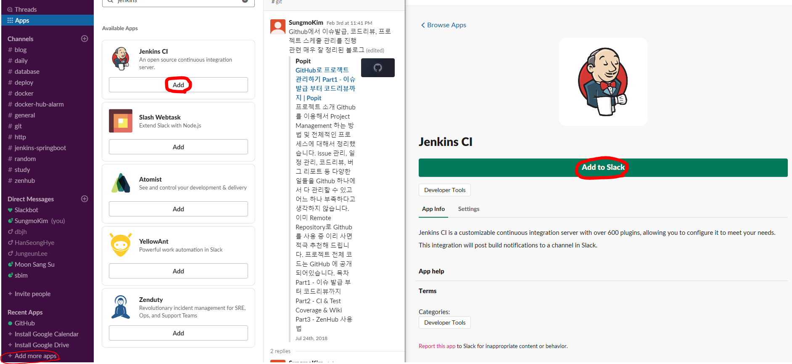
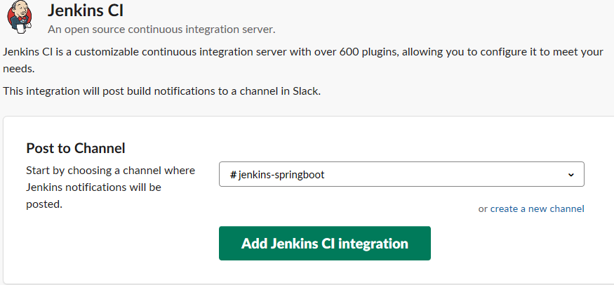
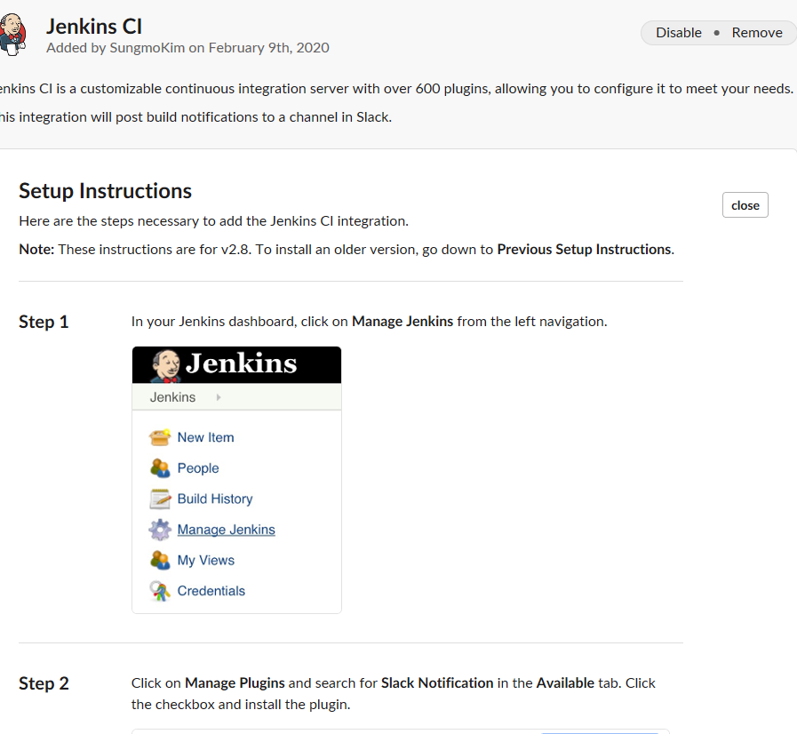
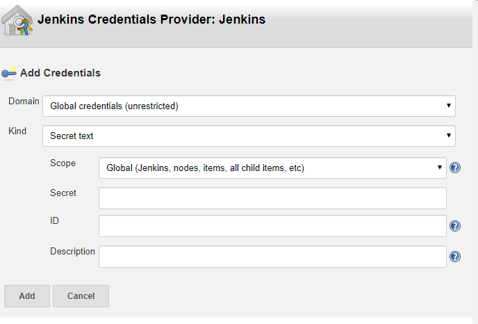
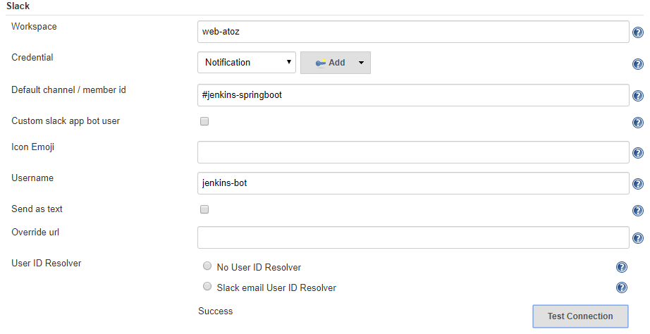
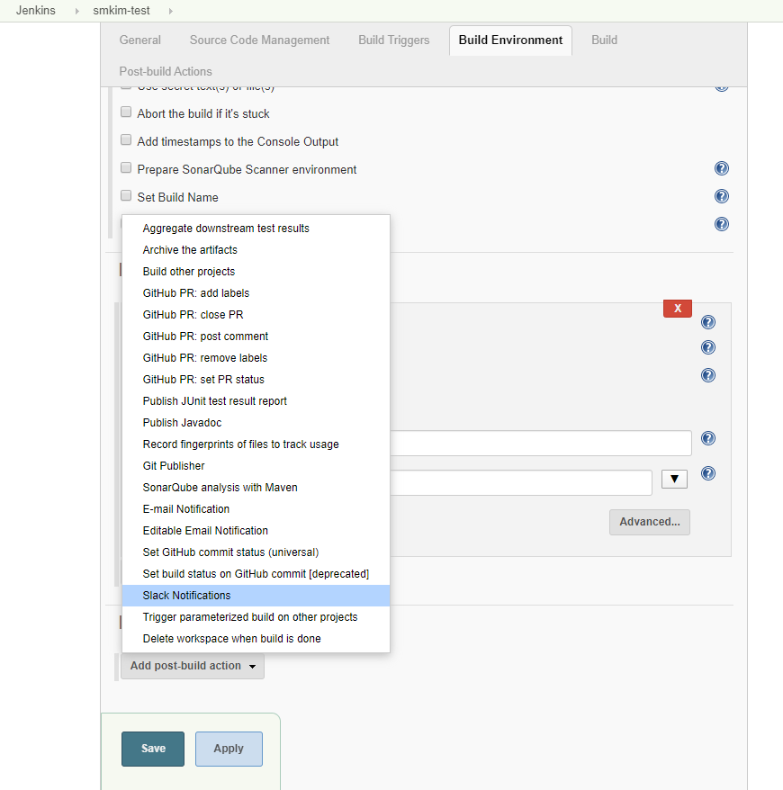
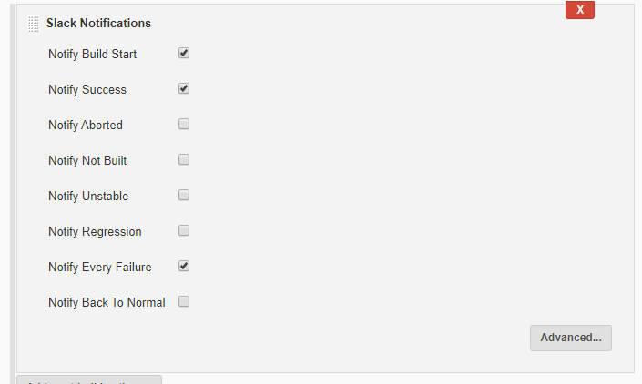

## Slack에 연결하여 Jenkins 알람 받기

다음과 같이 Add more apps -> Jenkins CI 검색 -> Add to Slack 을 해준다.

이제 Add Jenkins CI integration을 클릭하면 다음의 설명이 나오는데, Step1, Step2 는 그대로 따라한다.

Step 3에서는 `Team Subdomain` 과 `Integration Token Credential ID` 을 발급해주는 데 따로 기록해놓도록 한다.

위의 작업 중 Step2의 Slack Notification 을 설치 완료했다면 이제 Jenkins 관리페이지로 돌아와서 `Manage Jenkins` -> `Configure System` 을 클릭한다.

`컨트롤 + F` 를 눌러 Slack 을 찾은 후 

reference : 

[docker를 이용한 CI 구축 연습하기 (젠킨스, 슬랙)](https://jojoldu.tistory.com/139)