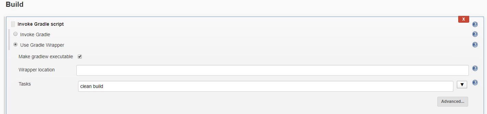

## bulid를 위한 명령어(Gradle)

스프링부트는 gradle 로 어플리케이션을 jar 파일로 만들고 실행하게 된다. 

이를 쉽게 지원해주는 gradle 플러그인이 있으므로 사용해보자.


### Gradle 명령어로 Clean Build



spring boot 실행 시킬 때 gradle 로 build 작업을 하게 된다.

현재 위의 코드는 리눅스에서 다음과 같다.

```
./gradlew clean build
```

현재 github에 변화를 감지한 jenkins가 git pull 을 받은 뒤  기존의 build 된 파일을 지우고 새롭게 build 작업을 실행한다는 의미이다.

### 현재 파일 위치 확인, 프로그램 실행 가능 여부 확인

그 다음으로 실제로 내가 jenkins job을 태웠을 때 위치가 어디인 지 확인을 해보자

그리고 현재 파일의 목록과 내가 실행시키고자 하는 프로그램(docker) 의 실행이 가능한 지 확인하자

```
pwd
ls -ll
docker ps
```


## shell script 명령어 

gradle 명령어로 스프링부트를 빌드하고 나면 이제 docker image로 만든 뒤 도커저장소로 push하는 작업을 통해서 도커 컨테이너 배포를 할 예정이다.

shell 환경에서 어떻게 배포를 위한 작업을 했는 지를 생각하며 다음의 스크립트를 작성하면 쉽게 접근할 수 있을 것이다. 


### Docker Image Build, Push

새롭게 받은 git repository의 소스코드로 새롭게 docker image를 만들어보자

우리가 만든 dockerfile을 통해  build가 될 수 있도록 작업하며, dockerhub 에 push 되는 작업을 진행한다.

```
docker login -u  -p 
docker build --build-arg JAR_FILE=build/libs/*.jar -t smkim08/springboot-docker-test .
docker tag smkim08/springboot-docker-test {이미지를 가져올 도커허브}
docker push {이미지를 가져올 도커허브}
```

우선 도커에 로그인하여 계정을 지정하고 그 뒤 로컬에서 만든 도커이미지를 태그를 달아서 나의 계정으로 푸쉬하는 단계이다.


## Docker pull, Container Delete, Docker run

```
docker pull webatoz/spring-docker:latest
docker stop test-springboot
docker rm -f test-springboot
docker run --name test-springboot -itd -p 80:80 {이미지를 가져올 도커허브}
```

현재 우리의 상황은 동일 서버에서 포트만 달리해서 jenkins를 가져가고 있으므로 docker pull 을 받는 것은 의미가 없을 수 있다.(현재 로컬의 이미지와 docker hub의 이미지는 동일할 것이기 때문)

하지만 일반적으로 실서버와 jenkins서버는 분할되므로 해당 과정을 추가하였다.

이미 실행중인 container 멈추고 지운다. 

이는 포트 중복 및 네이밍이 중복되어 에러가 나기 때문이다.

그다음 일반적인 실행 명령으로 docker run 을 시키면 된다.