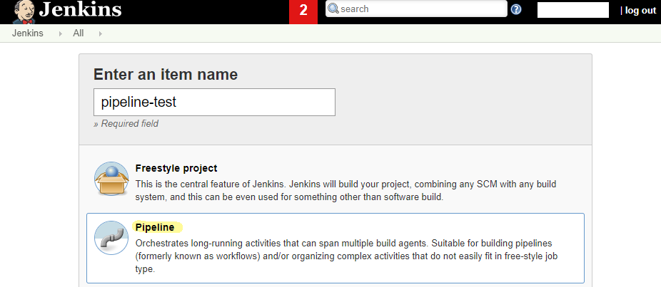

## Pipeline 만들기 

이번에는 new project를 만들어서 Freestyle project가 아닌 Pipeline을 작업해보도록 하겠다.



### Github project 에 URL 을 작성

Github에서의 webhook은 이미 사전에 설정하였으므로 이 곳에서 webhook을 인지하기 위하여 작업한다.


### This project is parameterized 를 클릭

앞으로의 Build 는 요청되는 파라미터에 따라서 동적 선택이 가능하도록 작업을 할 예정이다.


간단하게 String parameter로 EXECUTOR와 GIT_PROJECT_URL을 설정하였으므로 추 후 해당 내용으로 들어오는 값이 변경되어 동적인 빌드 작업을 수행할 수 있도록 한다. 


### Github hook trigger for GITScm polling 을 클릭

Github에서 push 작업이 수행되면 Jenkins에 push되었다고 알려주고 그것을 인지한 jenkins는 빌드 트리거가 되도록 한다. 


### Pipeline script 작성

마지막으로 pipeline이 실행되며 전체적인 배포 프로세스가 완성될 수 있도록 한다.


```
pipeline {
   agent any

   stages {
        stage('Check out') {
            steps {
                // Get some code from a GitHub repository
                git 'https://github.com/MaximSungmo/jenkins_test.git'
                sh "pwd"
            }
        }
      
        stage('Build') {
            steps {
                // Get some code from a GitHub repository
                sh "echo build"
            }
        }
      
        stage('TEST') {
            steps {
                // Get some code from a GitHub repository
                sh "echo testing....."
            }
        }
        
        stage('FINISH') {
            steps {
                // Get some code from a GitHub repository
                sh "echo finish!!"
            }
        }        
   }
}
```

이번 포스팅은 전체적인 구조에 대해 알기 위한 쉬운 예제로 준비하였으며 뒷 장에서는 실제 project를 배포할 수 있는 프로세스로 `code testing`, `docker build`, `docker run` 등을 상세 작업에 대해서 진행하도록 하겠다.


최종적으로 완료되어 git push를 진행한 결과 다음의 화면을 확인할 수 있다.


