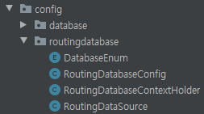
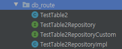
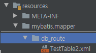

## 왜 동적으로 생성하는가? 

`다중 데이터베이스`에 대한 설정으로 `DataSource`를 설정하고 해당 폴더에서는 설정한 DataSource가 Injection이 될 수 있도록 작업하는 게 일반적이다.

즉, 정적으로 해당 폴더는 혹은 해당 클래스는 어떤 DataSource를 받을 지에 대하여 사전에 정의가 되어 있다는 의미이다. 

동일한 테이블이지만 Sharding이 될 수도 있고 고객마다 다른 Database를 확인해야 하는 경우가 있는데, 이를 처리하기 위해서 동적으로 `DataSource` 를 Injection 할 수 있는 방식이 필요했다.


## AbstractRoutingDataSource 설정법

- ### 디렉토리 

{: .align-center}

- ### DataSource 목록 관리

```java
public enum DatabaseEnum {
    DB_01,
    DB_02,
    DB_03;
}
```

위에 Enum에 정해진 값으로 넘어오는 경우에 따라서 DataSource를 선택할 수 있도록 할 예정이다.

즉, 클라이언트로부터 어떤 Database를 사용해야할 지에 대한 정보가 넘어오는 경우를 예시로 드는 상황이며 해당 사용자의 등급 또는 역할에 따라서 달라진다면 그 정보가 해당 Enum에 입력되거나 별도의 로직처리가 필요할 수 있다. 

아래에서 구현 시 `DatabaseEnum`의 값을 키 값으로 가져가므로 이 점을 생각하고 보길 바란다.


- ### DataSource를 ContextHolder에 넣기

```java
public class RoutingDatabaseContextHolder {

    private static ThreadLocal<DatabaseEnum> CONTEXT = new ThreadLocal<>();


    public static void set(DatabaseEnum clientDatabase) {

        Assert.notNull(clientDatabase, "RoutingDatabase cannot be null");
        CONTEXT.set(clientDatabase);
    }


    public static DatabaseEnum getClientDatabase() {

        return CONTEXT.get();
    }


    public static void clear() {

        CONTEXT.remove();
    }
}
```

`ThreadLocal`은 관련된 내용을 찾아보면 좋을 것 같은데 우선은 간략하게 풀어 쓰자면 다음과 같다.

>  ThreadLocal 클래스는 thread-local 변수들을 제공한다. 이 변수들은 get 또는 set 메소드를 통해 접근하는 각 스레드가 독립적으로 변수의 초기화 된 사본을 가지고 있다는 점에서 다르다. ThreadLocal 인스턴스들은 보통 스레드와 상태를 연결하려고 하는 클래스들의 private static 필드들이다. (예를들어, 유저 ID 또는 트랜잭션 ID) 

다음의 블로그([[JAVA] ThreadLocal](https://velog.io/@skygl/ThreadLocal))가 자세한 설명을 하고 있으니 참고하도록 하자 


- ### AbstractRoutingDataSource 구현(오버라이드)

```java
public class RoutingDataSource extends AbstractRoutingDataSource {

    @Override
    protected Object determineCurrentLookupKey() {

        return RoutingDatabaseContextHolder.getClientDatabase();
    }
}
```

이제 스프링 프레임워크에서 제공해주는 AbstractRoutingDataSource에서 `determineCurrentLookupKey()` 을 오버라이드하여 어떤 ContextHolder를 통해서 값을 매칭시켜 찾을 지 구현한다.


- ####  Routing이 가능한 DataSource 구현

이제 모든 설정 준비는 끝났다. 위의 `AbstractRoutingDataSource` 를 상속받아 구현한 `RoutingDataSource` 를 활용하여 `DataSource`를 라우팅하며 `ContextHolder`에서 찾아올 수 있도록 작업을 해주면 `return 값`으로 `DataSource`를 줄 수 있도록 하면 된다.

```java

@Configuration
@EnableJpaRepositories(entityManagerFactoryRef = "routeEntityManagerFactory",
        transactionManagerRef = "routeTransactionManager",
        basePackages = {DatabaseConfig.BASE_ENTITY_PACKAGE_PREFIX+".db_route"})
@MapperScan(basePackages = DatabaseConfig.BASE_ENTITY_PACKAGE_PREFIX + ".db_route",
        sqlSessionFactoryRef = "routeSqlSessionFactory")
public class RoutingDatabaseConfig extends DatabaseConfig {

    private final DataSource datasource1;
    private final DataSource datasource2;
    private final DataSource datasource3;


    public RoutingDatabaseConfig(
            @Qualifier("datasource1") DataSource dataSource1,
            @Qualifier("datasource2") DataSource datasource2, 
            @Qualifier("datasource3") DataSource datasource3) {

        this.datasource1 = datasource1;
        this.datasource2 = datasource2;
        this.datasource3 = datasource3;
    }


    @Bean("routeDataSource")
    public DataSource clientDatasource() {

        Map<Object, Object> targetDataSources = new HashMap<>();
        targetDataSources.put(DatabaseEnum.DB_01, dataSource1);
        targetDataSources.put(DatabaseEnum.DB_02, dataSource2);
        targetDataSources.put(DatabaseEnum.DB_03, dataSource3);

        RoutingDataSource dataSourceRouter = new RoutingDataSource();
        dataSourceRouter.setTargetDataSources(targetDataSources);
        dataSourceRouter.setDefaultTargetDataSource(dbBncAdmDataSource);

        return dataSourceRouter;
    }


    //--------------------------------- SQL SessionFactory -------------------------------------
    @Bean(name = "routeSqlSessionFactory")
    public SqlSessionFactory sqlSession(@Qualifier("routeDataSource") DataSource dbBncAdmDataSource) throws Exception {

        SqlSessionFactoryBean sessionFactoryBean = new SqlSessionFactoryBean();
        configureSqlSessionFactory(sessionFactoryBean, dbBncAdmDataSource);
        return sessionFactoryBean.getObject();
    }


    @Bean(name = "routeSqlSessionTemplate")
    public SqlSessionTemplate sqlSessionTemplate(@Qualifier("routeSqlSessionFactory") SqlSessionFactory sqlSessionFactory) {

        return new SqlSessionTemplate(sqlSessionFactory);
    }


    // -------------------------------- Jpa EntityManager ---------------------------------------------
    @Bean(name = "routeEntityManagerFactory")
    public LocalContainerEntityManagerFactoryBean routeEntityManagerFactory(@Qualifier("routeDataSource") DataSource dataSource) {

        LocalContainerEntityManagerFactoryBean containerEntityManagerFactoryBean = new LocalContainerEntityManagerFactoryBean();
        configureEntityFactory(containerEntityManagerFactoryBean, dataSource);

        return containerEntityManagerFactoryBean;
    }


    @Bean(name = "routeTransactionManager")
    public PlatformTransactionManager routeTransactionManager(
            @Qualifier("routeEntityManagerFactory") EntityManagerFactory entityManagerFactory) {

        JpaTransactionManager tm = new JpaTransactionManager();
        tm.setEntityManagerFactory(entityManagerFactory);

        return tm;
    }


    @Bean(name = "routeJPAQueryFactory")
    public JPAQueryFactory JPAQueryFactory(@Qualifier("routeEntityManagerFactory") EntityManager entityManager) {

        return new JPAQueryFactory(entityManager);
    }
}
```


## TEST 진행

### Repository 설정

- #### JPA Repository 설정

이제 Mybatis와 JPA를 사용할 수 있는 지 확인해보자.

별도의 디렉토리로 Entity가 들어가고 위의 설정에서 주입할 수 있도록 패키지를 다음과 같이 작업한다.

{: .align-center}

이는 Spring data JPA 를 테스트 하기 위한 준비라고 보면 된다. 내부 코드는 일반적인 JPA와 크게 다를 것이 없으니 생략하도록 하겠다. 

- #### Mybatis Repository 설정(Mapper사용하지 않음)

또한 Mybatis 사용을 위한 xml 설정 작업을 진행하자

{: .align-center}

위와 마찬가지로 일반적인 mybatis xml과 크게 다를 게 없으므로 생략하겠다.

### Database에 insert 

테스트는 `TestTable2` 에서 모든 데이터를 가져오는 것으로 설정하였고 각기 다른 데이터베이스에 `database1` , `database2` 라고 값을 입력하여 insert 시켜줬다.

```sql
SELECT * FROM test_table2
```

```sql
-- db1
INSERT INTO test_table2 values (... ,'database1');

-- db2
INSERT INTO test_table2 values (... ,'database2');
```


### Service 만들기

```java
@Service
@Validated
@RequiredArgsConstructor
public class DatabaseRoutingService {

    private final TestTable2Repository testTable2Repository;

    public List<TestTable2> readAllJpa(DatabaseEnum db) {
        RoutingDatabaseContextHolder.set(db);
        List<TestTable2> clientName = testTable2Repository.findAll();
        RoutingDatabaseContextHolder.clear();

        return clientName;
    }


    public List<TestTable2> readAllMybatis(DatabaseEnum db) {
        RoutingDatabaseContextHolder.set(db);
        List<TestTable2> clientName = testTable2Repository.readAll();
        RoutingDatabaseContextHolder.clear();

        return clientName;
    }
}
```

이제 Parameter로 값이 넘어오면 런타임상태에서 `DataSource`가 동적으로 변경되며 각기 다른 `DB` 에 붙는 것을 확인하도록 하겠다.

### Test 케이스

```java
@SpringBootTest(webEnvironment = SpringBootTest.WebEnvironment.MOCK, properties = AdminApplication.PROPERTIES)
public class routingDatabaseTest {

    @Autowired
    private DatabaseRoutingService databaseRoutingService;

    @Test
    public void JPARoutingTest(){
        List<TestTable2> testTable0 = databaseRoutingService.readAllJpa(DatabaseEnum.DB_01);
        Assertions.assertEquals("database1",testTable0.get(0).getC5());
        List<TestTable2> testTable00 = databaseRoutingService.readAllJpa(DatabaseEnum.DB_02);
        Assertions.assertEquals("database2",testTable00.get(0).getC5());
    }


    @Test
    public void MybatisRoutingTest(){
        List<TestTable2> testTable0 = databaseRoutingService.readAllJpa(DatabaseEnum.DB_01);
        Assertions.assertEquals("database1",testTable0.get(0).getC5());
        List<TestTable2> testTable00 = databaseRoutingService.readAllJpa(DatabaseEnum.DB_02);
        Assertions.assertEquals("database2",testTable00.get(0).getC5());
    }
}
```


자, 테스트케이스를 통해 성공했는 지 확인해보자. 

완료가 되었다면 이제 동적으로 `DataSource`를 변경시킬 수 있는 상황을 만들었다.


references :  

[AbstractRoutingDatasource 레퍼런스](https://www.baeldung.com/spring-abstract-routing-data-source) 


