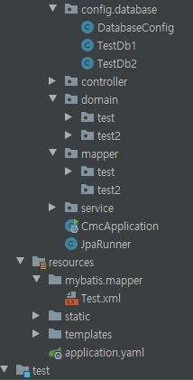

## Spring JPA 설정 따라하기

1. [[Spring] Spring JPA 시작하기(기본 설정 값, JPA 객체 생성)](https://maximsungmo.github.io/spring/0-jpa-start/)

2. [[Spring] 다중 데이터소스 설정(Multiple Datasource JPA, Mybatis)](https://maximsungmo.github.io/spring/1-datasource-configuration/)

3. [[Spring] application.yaml 설정하기 (다중 설정, custom.yaml 생성)](https://maximsungmo.github.io/spring/2-datasource-yaml-change/)

4. [[Spring] Controller와 Service 생성하기](https://maximsungmo.github.io/spring/3-jpa-controller-service/)

5. [[Spring] 간단한 TestCase 만들기](https://maximsungmo.github.io/spring/4-jpa-test-case/)

6. [[Spring] Querydsl 설정하기](https://maximsungmo.github.io/spring/5-jpa-querydsl/)


## 다중데이터소스 설정법

다중 데이터 소스를 설정하는 방법에 대해 알아보겠다.

데이터베이스가 하나만 존재하는 경우에는 간단하게 application.yaml 에 설정 내용만 추가하면 바로 사용이 가능했다. 그러나 데이터베이스가 여러 개 존재하는 경우에는 여러 데이터소스를 만들어서 transaction도 잡아주고 DB위치도 다르게 잡아줘야 한다.

우선은 예시를 위한 디렉토리 구조를 살펴보겠다.

### 디렉토리 구조

{: .align-center}


중점으로 봐야할 파일은 `config.database` 디렉토리의 하위 파일이다.

다중데이터소스 설정을 위한 첫 번째 단계는 `application.yaml`에 database에 대한 정보를 적어주는 일을 한다.


### application.yaml에 DataSource 여러 개 입력하기

```yaml
spring:
  datasource:
    testdb1:
      maximum-pool-size: 4
      jdbc-url: jdbc:postgresql://localhost:5432/test
      username: postgres
      password:
      driver-class-name: org.postgresql.Driver


    testdb2:
      maximum-pool-size: 4
      jdbc-url: jdbc:postgresql://localhost:5432/test2
      username: postgres
      password:
      driver-class-name: org.postgresql.Driver
```


이제 2개의 데이터베이스에 접근하기 위한 datasource를 지정해주는 파일을 만들어보겠다.


### JPA DataSource 설정하기

```java
@Configuration
@ConfigurationProperties(prefix = "spring.datasource." + "testdb1")
@EnableJpaRepositories(
        entityManagerFactoryRef = "testdb1" + "EntityManagerFactory",
        transactionManagerRef = "testdb1" + "TransactionManager",
        basePackages = {DatabaseConfig.BASE_ENTITY_PACKAGE_PREFIX + ".test"}
)
public class TestDb1 extends DatabaseConfig {
    final String name = "testdb1";


    @Bean(name = name + "DataSource")
    @Primary
    public DataSource dataSource() {
        return new LazyConnectionDataSourceProxy(new HikariDataSource(this));
    }

    /* -----------------JPA 셋팅------------------------------------- */
    @Bean(name = name + "EntityManagerFactory")
    @Primary
    public EntityManagerFactory entityManagerFactory(@Qualifier(name + "DataSource") DataSource dataSource) {
        LocalContainerEntityManagerFactoryBean factory = new LocalContainerEntityManagerFactoryBean();
        factory.setDataSource(dataSource);
        factory.setPackagesToScan("com.cafe24.cmc.domain.test");
        factory.setPersistenceUnitName(name);        
        setConfigureEntityManagerFactory(factory);

        return factory.getObject();
    }


    @Bean(name = name + "TransactionManager")
    @Primary
    public PlatformTransactionManager transactionManager(@Qualifier(name + "EntityManagerFactory") EntityManagerFactory entityManagerFactory) {
        JpaTransactionManager tm = new JpaTransactionManager();
        tm.setEntityManagerFactory(entityManagerFactory);

        return tm;
    }
}
```

- @ConfigurationProperties(prefix = "spring.datasource." + "testdb1") : application.yaml에서 어떤 properties를 읽을 지 지정한다.
- @EnableJpaRepositories(...) : Jpa에 관한 설정 및 파일의 위치는 어디에 있는 지 명시한다.
- @Bean(...) : 각 메소드들을 빈으로 등록하며 빈의 이름을 지정하여 동일한 클래스일지라도 @Qulifier를 통한 선택적 주입이 가능하게 한다.
- @Primary : 첫 째 DB소스는 무엇인 지 명시합니다. 이 후 생성될 DB는 @Primary가 없어야 한다.


차례대로 살펴보면 다음과 같습니다.

```java
    @Bean(name = name + "DataSource")
    @Primary
    public DataSource dataSource() {
        return new LazyConnectionDataSourceProxy(new HikariDataSource(this));
    }
```

DataSource Interface를 상속받아 구현된 DataSource를 생성한다. DataSource interface로 만들어질 DataSource는 여러개가 될 것이므로 @Bean(name="")을 통해 해당 객체를 Context에 등록할 때 bean의 이름을 지정한다. 채택된 방법은 LazyConnectionDataSourceProxy이며 단순하게 HikariDataSource만 return해도 무방하다.

[[LazyConnectionDataSourceProxy 채택 이유\]](https://kwonnam.pe.kr/wiki/springframework/lazyconnectiondatasourceproxy)

```java
    @Bean(name = name + "EntityManagerFactory")
    @Primary
    public EntityManagerFactory entityManagerFactory(@Qualifier(name + "DataSource") DataSource dataSource) {
        LocalContainerEntityManagerFactoryBean factory = new LocalContainerEntityManagerFactoryBean();
        factory.setDataSource(dataSource);
        factory.setPackagesToScan("com.cafe24.cmc.domain.test");
        factory.setPersistenceUnitName(name);
        setConfigureEntityManagerFactory(factory);

        return factory.getObject();
    }
```

EntityManagerFactory에 필요한 추가 설정 작업을 해주어 `factory.setPackagesToScan("com.cafe24.cmc.domain.test");` 에 내용을 스캔할 수 있도록 설정한다.

```java
    @Bean(name = name + "TransactionManager")
    @Primary
    public PlatformTransactionManager transactionManager(@Qualifier(name + "EntityManagerFactory") EntityManagerFactory entityManagerFactory) {
        JpaTransactionManager tm = new JpaTransactionManager();
        tm.setEntityManagerFactory(entityManagerFactory);

        return tm;
    }
```

마지막으로 TransactionManger를 설정해주어 transaction이 하나의 datasource에서 발생할 시 지켜질 수 있도록 설정한다.

### Mybatis 설정 추가

```java
@MapperScan(
        basePackages = {DatabaseConfig.BASE_MAPPER_PACKAGE_PREFIX + ".test"}
)
public class TestDb1 extends DatabaseConfig {

....
```

```java
    /* -----------------mybatis 셋팅------------------------------------- */
    @Bean(name = name + "SessionFactory")
    @Primary
    public SqlSessionFactory sqlSessionFactory(@Qualifier(name + "DataSource") DataSource dataSource) throws Exception {
        SqlSessionFactoryBean sessionFactoryBean = new SqlSessionFactoryBean();
        setConfigureSqlSessionFactory(sessionFactoryBean, dataSource);

        return sessionFactoryBean.getObject();
    }


    @Bean(name = name + "SqlSessionTemplate")
    @Primary
    public SqlSessionTemplate firstSqlSessionTemplate(@Qualifier(name + "SessionFactory") SqlSessionFactory sqlSessionFactory) {
        return new SqlSessionTemplate(sqlSessionFactory);
    }
```

Mybatis의 경우 SessionFactory를 통해 SqlSession이 Datasource를 물고 있다. 따라서 Mapper가 존재하는 파일의 위치를 읽을 수 있도록 지정해주고 JPA 셋팅과 동일하게 datasource를 설정한다.

## 전체 코드

### 파일명 : TestDb1

```java
@Configuration
@ConfigurationProperties(prefix = "spring.datasource." + "testdb1")
@EnableJpaRepositories(
        entityManagerFactoryRef = "testdb1" + "EntityManagerFactory",
        transactionManagerRef = "testdb1" + "TransactionManager",
        basePackages = {DatabaseConfig.BASE_ENTITY_PACKAGE_PREFIX + ".test"}
)
@MapperScan(
        basePackages = {DatabaseConfig.BASE_MAPPER_PACKAGE_PREFIX + ".test"}
)
public class TestDb1 extends DatabaseConfig {
    final String name = "testdb1";


    @Bean(name = name + "DataSource")
    @Primary
    public DataSource dataSource() {
        return new LazyConnectionDataSourceProxy(new HikariDataSource(this));
    }


    /* -----------------mybatis 셋팅------------------------------------- */
    @Bean(name = name + "SessionFactory")
    @Primary
    public SqlSessionFactory sqlSessionFactory(@Qualifier(name + "DataSource") DataSource dataSource) throws Exception {
        SqlSessionFactoryBean sessionFactoryBean = new SqlSessionFactoryBean();
        setConfigureSqlSessionFactory(sessionFactoryBean, dataSource);

        return sessionFactoryBean.getObject();
    }


    @Bean(name = name + "SqlSessionTemplate")
    @Primary
    public SqlSessionTemplate firstSqlSessionTemplate(@Qualifier(name + "SessionFactory") SqlSessionFactory sqlSessionFactory) {
        return new SqlSessionTemplate(sqlSessionFactory);
    }


    /* -----------------JPA 셋팅------------------------------------- */
    @Bean(name = name + "EntityManagerFactory")
    @Primary
    public EntityManagerFactory entityManagerFactory(@Qualifier(name + "DataSource") DataSource dataSource) {
        LocalContainerEntityManagerFactoryBean factory = new LocalContainerEntityManagerFactoryBean();
        factory.setDataSource(dataSource);
        factory.setPackagesToScan("com.cafe24.cmc.domain.test");
        factory.setPersistenceUnitName(name);
        setConfigureEntityManagerFactory(factory);

        return factory.getObject();
    }


    @Bean(name = name + "TransactionManager")
    @Primary
    public PlatformTransactionManager transactionManager(@Qualifier(name + "EntityManagerFactory") EntityManagerFactory entityManagerFactory) {
        JpaTransactionManager tm = new JpaTransactionManager();
        tm.setEntityManagerFactory(entityManagerFactory);
        
        return tm;
    }
}
```


두 번째 데이터소스를 설정하기 위해선 동일한 작업을 해줍니다. 

### 파일명 : TestDb2

```java
@Configuration
@ConfigurationProperties(prefix = "spring.datasource." + "testdb2")
@EnableJpaRepositories(
        entityManagerFactoryRef = "testdb2" + "EntityManagerFactory",
        transactionManagerRef = "testdb2" + "TransactionManager",
        basePackages = {DatabaseConfig.BASE_ENTITY_PACKAGE_PREFIX + ".test2"}
)
@MapperScan(
        basePackages = {DatabaseConfig.BASE_MAPPER_PACKAGE_PREFIX + ".test2"}
)
public class TestDb2 extends DatabaseConfig {
    final String name = "testdb2";


    @Bean(name = name + "DataSource")
    public DataSource dataSource() {
        return new LazyConnectionDataSourceProxy(new HikariDataSource(this));
    }


    /* -----------------mybatis 셋팅------------------------------------- */
    @Bean(name = name + "SessionFactory")
    public SqlSessionFactory sqlSessionFactory(@Qualifier(name + "DataSource") DataSource dataSource) throws Exception {
        SqlSessionFactoryBean sessionFactoryBean = new SqlSessionFactoryBean();
        setConfigureSqlSessionFactory(sessionFactoryBean, dataSource);

        return sessionFactoryBean.getObject();
    }


    @Bean(name = name + "SqlSessionTemplate")
    public SqlSessionTemplate firstSqlSessionTemplate(@Qualifier(name + "SessionFactory") SqlSessionFactory sqlSessionFactory) {
        return new SqlSessionTemplate(sqlSessionFactory);
    }


    /* -----------------JPA 셋팅------------------------------------- */
    @Bean(name = name + "EntityManagerFactory")
    public EntityManagerFactory entityManagerFactory(@Qualifier(name + "DataSource") DataSource dataSource) {
        LocalContainerEntityManagerFactoryBean factory = new LocalContainerEntityManagerFactoryBean();
        factory.setDataSource(dataSource);
        factory.setPackagesToScan("com.cafe24.cmc.domain.test2");
        factory.setPersistenceUnitName("testdb2");
        setConfigureEntityManagerFactory(factory);

        return factory.getObject();
    }


    @Bean(name = name + "TransactionManager")
    public PlatformTransactionManager transactionManager(@Qualifier(name + "EntityManagerFactory") EntityManagerFactory entityManagerFactory) {
        JpaTransactionManager tm = new JpaTransactionManager();
        tm.setEntityManagerFactory(entityManagerFactory);

        return tm;
    }
}
```

동일한 코드가 반복됨에 따라 설정을 조금 더 쉽게 관리하기 위하여 설정 파일을 분리하였습니다.

### 파일명 : DatabaseConfig

```java
public abstract class DatabaseConfig extends HikariConfig {
    public static final String BASE_MAPPER_PACKAGE_PREFIX = "com.cafe24.cmc.mapper";
    public static final String BASE_ENTITY_PACKAGE_PREFIX = "com.cafe24.cmc.domain";

    protected void setConfigureEntityManagerFactory(LocalContainerEntityManagerFactoryBean factory) {
        JpaVendorAdapter vendorAdapter = new HibernateJpaVendorAdapter();
        factory.setJpaVendorAdapter(vendorAdapter);
        factory.setJpaPropertyMap(ImmutableMap.of(
                "hibernate.hbm2ddl.auto", "update",
                "hibernate.dialect", "org.hibernate.dialect.PostgreSQL10Dialect",
                "hibernate.show_sql", "true",
                "hibernate.format_sql", "true"
        ));
        factory.afterPropertiesSet();
    }

    protected void setConfigureSqlSessionFactory(SqlSessionFactoryBean sessionFactoryBean, DataSource dataSource) throws IOException {
        sessionFactoryBean.setDataSource(dataSource);
        PathMatchingResourcePatternResolver resolver = new PathMatchingResourcePatternResolver();
        sessionFactoryBean.setMapperLocations(resolver.getResources("classpath*:mybatis/mapper/**/*.xml"));
    }
}
```


ImmutableMap.of() 를 사용하기 위해서는 다음의 내용을 build.gradle에 추가합니다.

### 파일명: build.gradle

```groovy
// https://mvnrepository.com/artifact/com.google.guava/guava
compile group: 'com.google.guava', name: 'guava', version: '28.1-jre'
```


references: 

[[LazyConnectionDataSourceProxy 채택 이유\]](https://kwonnam.pe.kr/wiki/springframework/lazyconnectiondatasourceproxy)