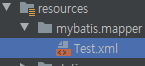
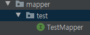
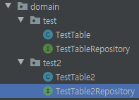

## Repository 준비

### mybatis 



```xml
<?xml version="1.0" encoding="UTF-8"?>
<!DOCTYPE mapper PUBLIC "-//mybatis.org//DTD Mapper 3.0//EN" "http://mybatis.org/dtd/mybatis-3-mapper.dtd">
<mapper namespace="com.cafe24.cmc.mapper.test.TestMapper">

    <select id="getAll" resultType="map">
        SELECT *
        FROM test_table
    </select>
</mapper>
```



```java
import com.cafe24.cmc.domain.test.TestTable;
import org.springframework.stereotype.Repository;


import java.util.List;
import java.util.Map;


@Repository
public interface TestMapper {
    Map<String, Object> getAll() throws Exception;
}
```


### JPA Repository



```java
import lombok.Data;
import lombok.NoArgsConstructor;
import javax.persistence.*;
import java.util.Date;


@Entity(name = "test_table")
@NoArgsConstructor
@Data
public class TestTable {


    @Id
    @GeneratedValue(strategy = GenerationType.SEQUENCE, generator = "TEST_SEQ_GENERATOR")
    private int c1;


    @Column(name = "c2",length = 16)
    private String c2 ;


    @Column(name = "insert_date", length = 20)
    private Date insertDate = new Date();


    @Column(name="c3")
    private String c3;
}
```

```java
import lombok.Data;
import lombok.NoArgsConstructor;


import javax.persistence.*;
import java.util.Date;


@Entity(name = "test_table")
@NoArgsConstructor
@Data
public class TestTable2 {


    @Id
    @GeneratedValue(strategy = GenerationType.SEQUENCE, generator = "TEST2_SEQ_GENERATOR")
    private int c1;


    @Column(name = "c2",length = 16)
    private String c2 ;


    @Column(name = "insert_date", length = 20)
    private Date insertDate = new Date();


    @Column(name="c3")
    private String c3;
}
```

```java
import org.springframework.data.jpa.repository.JpaRepository;
import org.springframework.stereotype.Repository;
import java.util.List;


@Repository
public interface TestTableRepository extends JpaRepository<TestTable, Integer> {
}
```


## Controller 


```java
import com.cafe24.cmc.domain.test.TestTable;
import com.cafe24.cmc.domain.test2.TestTable2;
import com.cafe24.cmc.mapper.test.TestMapper;
import com.cafe24.cmc.service.TestService;
import lombok.RequiredArgsConstructor;
import org.springframework.stereotype.Controller;
import org.springframework.web.bind.annotation.RequestMapping;
import org.springframework.web.bind.annotation.ResponseBody;
import java.util.List;
import java.util.Map;
import java.util.Optional;

@Controller
@RequiredArgsConstructor
public class indexController {

    private final TestService testService;

    @RequestMapping("/mybatis")
    @ResponseBody
    public Map<String, Object> getAll() throws Exception {
        return testService.getAll();
    }

    @RequestMapping("/multiple")
    @ResponseBody
    public List<TestTable2> getAllUsrAdmA() throws Exception {
        return testService.getUsr();
    }
}
```


## Service

```java
import com.cafe24.cmc.domain.test.TestTable;
import com.cafe24.cmc.domain.test.TestTableRepository;
import com.cafe24.cmc.domain.test2.TestTable2;
import com.cafe24.cmc.domain.test2.TestTable2Repository;
import com.cafe24.cmc.mapper.test.TestMapper;
import lombok.RequiredArgsConstructor;
import org.springframework.stereotype.Service;


import java.util.List;
import java.util.Map;
import java.util.Optional;


@Service
@RequiredArgsConstructor
public class TestService {


    private final TestTableRepository testTableRepository;
    private final TestTable2Repository testTable2Repository;
    private final TestMapper testMapper;

    public List<TestTable2> getUsr() {
        return testTable2Repository.findAll();
    }


    public Map<String, Object> getAll() throws Exception {
        return testMapper.getAll();
    }
}
```


이제 설정이 완료되었으니 정상적으로 웹페이지가 뜨는 지 확인합시다.