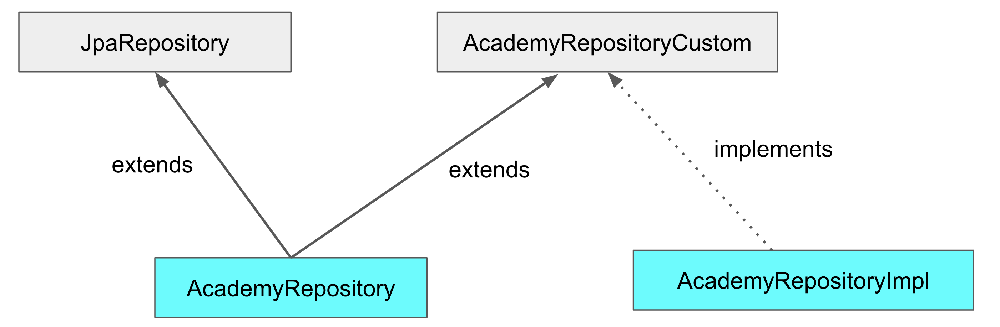
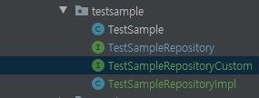

## Spring JPA 설정 따라하기

1. [[Spring] Spring JPA 시작하기(기본 설정 값, JPA 객체 생성)](https://maximsungmo.github.io/spring/0-jpa-start/)

2. [[Spring] 다중 데이터소스 설정(Multiple Datasource JPA, Mybatis)](https://maximsungmo.github.io/spring/1-datasource-configuration/)

3. [[Spring] application.yaml 설정하기 (다중 설정, custom.yaml 생성)](https://maximsungmo.github.io/spring/2-datasource-yaml-change/)

4. [[Spring] Controller와 Service 생성하기](https://maximsungmo.github.io/spring/3-jpa-controller-service/)

5. [[Spring] 간단한 TestCase 만들기](https://maximsungmo.github.io/spring/4-jpa-test-case/)

6. [[Spring] Querydsl 설정하기](https://maximsungmo.github.io/spring/5-jpa-querydsl/)


## Querydsl 설정법

### build.gradle

최상단에 다음의 buildScript 추가

```groovy
// queryDsl 
buildscript {
    ext{
        querydslPluginVersion = '1.0.10'
    }
    repositories {
        maven { url "https//plugins.gradle.org/m2/"}
    }
    dependencies {
        classpath("gradle.plugin.com.ewerk.gradle.plugins:querydsl-plugin:${querydslPluginVersion}")
    }
}
```

이 후 부터는 `// querydsl` 이라고 작성된 부분을 유의하면서 확인하자.

```groovy
configurations {
    developmentOnly
    runtimeClasspath {
        extendsFrom developmentOnly
    }
    compileOnly {
        extendsFrom annotationProcessor
    }

    // querydsl
    querydsl.extendsFrom compileClasspath
}
```

```groovy
dependencies {
        ...

    // querydsl
    implementation("com.querydsl:querydsl-jpa") // querydsl
    implementation("com.querydsl:querydsl-apt") // querydsl
}
```

```groovy
// querydsl
// Plugin 적용
apply plugin: "com.ewerk.gradle.plugins.querydsl" 

// QClass 생성 위치
def querydslSrcDir = 'src/main/generated' 

querydsl {
    library = "com.querydsl:querydsl-apt"
    jpa = true
    querydslSourcesDir = querydslSrcDir
}


sourceSets {
    main {
        java {
            srcDirs = ['src/main/java', querydslSrcDir]
        }
    }
}


compileQuerydsl{
    options.annotationProcessorPath = configurations.querydsl
}
```


### Java Config 설정

```java
@Configuration
public class QuerydslConfig {


    @PersistenceContext
    private EntityManager entityManager;


    @Bean
    public JPAQueryFactory jpaQueryFactory() {
        return new JPAQueryFactory(entityManager);
    }
}
```


### BootRun 실행시켜보기 

정상적으로 어플리케이션이 실행이 되는 지 확인하자.

이 단계에서는 querydsl에 대한 테스트를 하는 것은 아니고 설정내용이 제대로 적용되어서 어플리케이션 동작에 문제가 없는 지 확인하는 단계이다. 

querydsl 을 사용할 수 있게 되었다면 다음과 같은 디렉토리 구조가 생성되었을 것이다.

```java
main/ 
    generated/
    ...
        testsample/
            QTestSample.java
```

설정에 의해서 querydsl에 필요한 파일들은 위와 같이 generated 위치에 생성됩니다.


### Repository 적용하기

우리는 JpaRepository를 상속받은 repository 클래스가 있다. 

JPA사용할 때 querydsl도 같이 사용할 것이고 이에 따라서 repository도 service에서 하나만 가져다가 쓰고 싶은데, 그렇게 하기 위한 작업이 필요하다.

그 전에 하나의 repository 에서 어떻게 JpaRepository의 기능과 querydsl에서 정의한 메소드를 사용할 수 있는지에 대한 전체적인 그림을 보겠다. 

{: .align-center}


해당 작업을 위한 디렉토리구조는 다음과 같다.

{: .align-center}

```java
com/ 
    domain/
        testsample/
			TestSampleRepositoryCustom
			TestSampleRepositoryImpl
```


```java
public interface TestSampleRepositoryCustom {
    List<TestSample> findByName(String name);
}
```

```java
@RequiredArgsConstructor
public class TestSampleRepositoryImpl implements TestSampleRepositoryCustom {

    private final JPAQueryFactory jpaQueryFactory;

    @Override
    public List<TestSample> findByName(String name) {
        return jpaQueryFactory.selectFrom(testSample)
                .where(testSample.name.eq(name))
                .fetch();
    }
}
```


추가적으로 JpaRepository를 상속받았던 TestSampleRepository에 내용을 추가한다.

```java
@Repository
public interface TestSampleRepository extends JpaRepository<TestSample, String>, TestSampleRepositoryCustom {
}
```


이제 Service에서 위의 TestSampleRepository 를 의존성 주입 받은 뒤 TestSampleRepositoryImpl에서 구현했던 findByName 기능을 사용할 수 있다.


### 테스트

단순하게 제대로 진행이 되는지만 확인하고 마무리 짓기 위해서 다음의 코드를 테스트케이스에 추가한다.

```java
@Test
public void querydslTest() {
    System.out.println(testSampleRepository.findByName("test_name"));
}
```


### 주의사항

위에서 generated라는 디렉토리에 관해서는 자동생성되는 파일의 디렉토리이니 .gitignore에 추가해주시면 됩니다. 

- .gitignore

```
/src/main/generated/
```


references:

[Spring Boot Data Jpa 프로젝트에 Querydsl 적용하기](https://jojoldu.tistory.com/372)