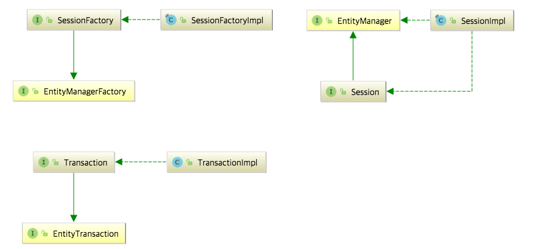
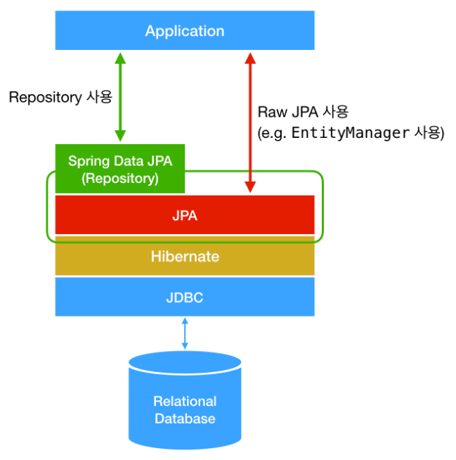

Spring을 공부하다보면 JPA를 만나게 된다.보통 학습곡선이 높다는 이유로 또는 실제로 사용하기 어렵다는 이유로 이야기만 대충 듣고 넘어가는 편이 많을 것이라고 아주 지극히 개인적인 생각을 하고 있다.

나 또한 `JPA는 학습곡선이 높으니 나중에 시간이 많이 남으면 적용은 해보자` 라고 막연한 불안감에 시작도 하지 못하고 있었다. 

물론 지금도 잘 사용하는 편은 아니지만 다른 이들이 나와 같은 고민으로 시간을 낭비하지 않길 바라며 기록을 남겨본다. 


## JPA, Hibernate, Spring JPA 각각의 차이점은 무엇일까?

JPA라고 불리는 것에 대해서 사람마다 지역마다 다른 이름으로 부르는 것이 아니였나? 이에 대한 궁금증을 해소하고자 한다.


### 가장 범용적으로 불리던 JPA란 과연 무엇인가?

우선은 JPA의 약자를 풀어보자. Java Persistence API 이다. JPA는 특정 기능을 하는 라이브러리가 아니고 명세서와 같다. JPA를 정의한 javax.persistence 패키지를 확인하면 조금 더 자세하게 확인할 수 있다. 


### 그렇다면 Hibernate는 ? JPA랑 다른 게 뭔데?

Hibernate는 JPA를 구현한 여러 라이브러리 중 하나이다. 다만, 가장 많이 사용되는 게 Hibernate이기 때문에 여러 서적, 블로그자료에서 Hibernate를 사용하는 것을 알 수 있다. JPA를 구현한 라이브러리.... 즉, 쉽게 생각하면 JPA는 자바의 Interface와 비슷하게 생각하고 Hibernate는 JPA라는 Interface를 구현한 구현체라고 보면 된다.

실제로 우리가 스프링에서 DB를 연결하기 위해서는 Datasource를 설정하고 EntityManagerFactory, EntityTransaction에 대한 설정을 하게 된다.

아래의 사진은 JPA와 Hibernate의 상속 및 구현 관계를 나타낸 것이다.

{: .align-center}

JPA의 구현체는 Hibernate 외 여러 구현체가 있으나 널리 사용되는 Hibernate만 언급하도록 하겠다.


### Hibernate가 JPA를 구현한 구현체라면 Spring Data JPA는 그 외 여러 구현체 중 하나인가?

Spring Data JPA 는 Hibernate와 같은 수준에서의 구현체가 아니라 JPA를 더욱 쉽고 편하게 사용할 수 있도록 만들어 놓은 모듈이다. 직관적인 구조 파악을 위하여 아래의 그림을 참고하길 바란다. 

{: .align-center}


**Spring Data JPA**가 JPA를 추상화했다는 말은, Spring Data JPA의 Repository의 구현에서 JPA를 사용하고 있다는 것이다. 예를 들어, Repository 인터페이스의 기본 구현체인 SimpleJpaRepository의 코드를 보면 아래와 같이 내부적으로 EntityManager을 사용하고 있는 것을 볼 수 있다.

즉, JPA를 이용한 라이브러리로 보면 쉽게 이해가 될 수 있을 것으로 생각한다. 

```java
package org.springframework.data.jpa.repository.support;

import ...

public class SimpleJpaRepository<T, ID> implements JpaRepositoryImplementation<T, ID> {

    private final EntityManager em;

    public Optional<T> findById(ID id) {

        Assert.notNull(id, ID_MUST_NOT_BE_NULL);

        Class<T> domainType = getDomainClass();

        if (metadata == null) {
            return Optional.ofNullable(em.find(domainType, id));
        }

        LockModeType type = metadata.getLockModeType();

        Map<String, Object> hints = getQueryHints().withFetchGraphs(em).asMap();

        return Optional.ofNullable(type == null ? em.find(domainType, id, hints) : em.find(domainType, id, type, hints));
    }

    // Other methods...
}
```

관련된 내용은 [JPA, Hibernate, 그리고 Spring Data JPA의 차이점](https://suhwan.dev/2019/02/24/jpa-vs-hibernate-vs-spring-data-jpa/) 에서 대부분의 내용을 참고하였으며 추가적으로 이해가 부족했던 내용이나 개인적으로 궁금했던 사항은 Spring data JPA의[Spring Data JPA - Reference Documentation](https://docs.spring.io/spring-data/jpa/docs/1.0.0.M1/reference/html/#project) 을 참고했다.


references :  
[Spring Data JPA - Reference Documentation](https://docs.spring.io/spring-data/jpa/docs/1.0.0.M1/reference/html/#project) 

[JPA, Hibernate, 그리고 Spring Data JPA의 차이점](https://suhwan.dev/2019/02/24/jpa-vs-hibernate-vs-spring-data-jpa/)


